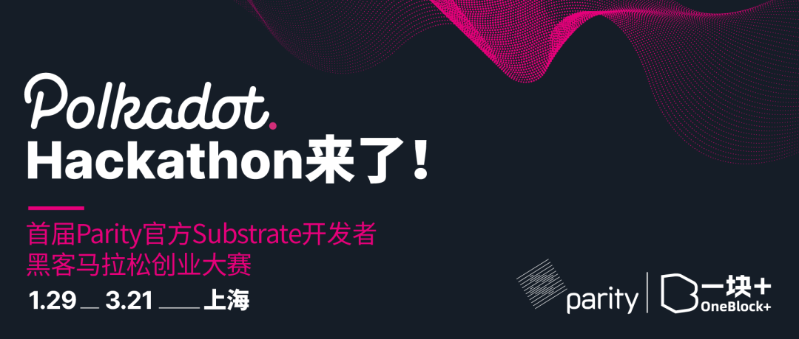
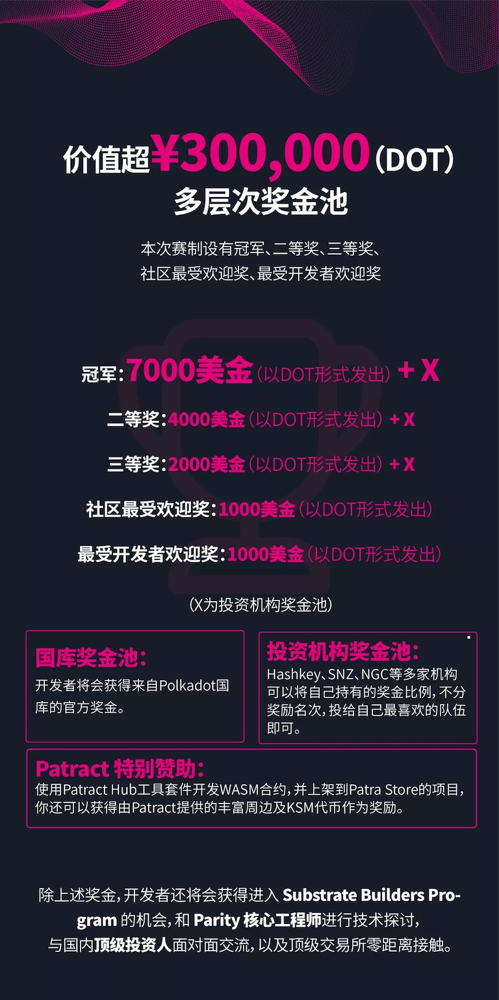

# 首届 Parity 官方 Substrate 开发者黑客马拉松报名开始了！

[微信原文](https://mp.weixin.qq.com/s/eoWgLSrjptHoyMrAE4UP-g)

<!-- MarkdownTOC autolink="true" lowercase="false" -->

- [活动亮点](#%E6%B4%BB%E5%8A%A8%E4%BA%AE%E7%82%B9)
- [参赛类别](#%E5%8F%82%E8%B5%9B%E7%B1%BB%E5%88%AB)
- [Hackathon 奖金](#Hackathon-%E5%A5%96%E9%87%91)
- [评委](#%E8%AF%84%E5%A7%94)
- [比赛形式](#%E6%AF%94%E8%B5%9B%E5%BD%A2%E5%BC%8F)
- [你将收获](#%E4%BD%A0%E5%B0%86%E6%94%B6%E8%8E%B7)
- [评分维度](#%E8%AF%84%E5%88%86%E7%BB%B4%E5%BA%A6)
- [合法合规性](#%E5%90%88%E6%B3%95%E5%90%88%E8%A7%84%E6%80%A7)
- [比赛提交](#%E6%AF%94%E8%B5%9B%E6%8F%90%E4%BA%A4)
  - [A. 代码提交（3月15日）](#A-%E4%BB%A3%E7%A0%81%E6%8F%90%E4%BA%A4%EF%BC%883%E6%9C%8815%E6%97%A5%EF%BC%89)
  - [B. Demo Day 演示前修改审核阶段（3月15日-3月18日）](#B-Demo-Day-%E6%BC%94%E7%A4%BA%E5%89%8D%E4%BF%AE%E6%94%B9%E5%AE%A1%E6%A0%B8%E9%98%B6%E6%AE%B5%EF%BC%883%E6%9C%8815%E6%97%A5-3%E6%9C%8818%E6%97%A5%EF%BC%89)
  - [C. 赛前淘汰（3月18日-3月19日）](#C-%E8%B5%9B%E5%89%8D%E6%B7%98%E6%B1%B0%EF%BC%883%E6%9C%8818%E6%97%A5-3%E6%9C%8819%E6%97%A5%EF%BC%89)
  - [D. Demo Day 演示提交内容规则（3月19日）](#D-Demo-Day-%E6%BC%94%E7%A4%BA%E6%8F%90%E4%BA%A4%E5%86%85%E5%AE%B9%E8%A7%84%E5%88%99%EF%BC%883%E6%9C%8819%E6%97%A5%EF%BC%89)
- [关于所有权和知识产权](#%E5%85%B3%E4%BA%8E%E6%89%80%E6%9C%89%E6%9D%83%E5%92%8C%E7%9F%A5%E8%AF%86%E4%BA%A7%E6%9D%83)
- [Hackathon 周末时间地点安排](#Hackathon-%E5%91%A8%E6%9C%AB%E6%97%B6%E9%97%B4%E5%9C%B0%E7%82%B9%E5%AE%89%E6%8E%92)
  - [A. 重要时间安排](#A-%E9%87%8D%E8%A6%81%E6%97%B6%E9%97%B4%E5%AE%89%E6%8E%92)
  - [B. 48 小时 Hackathon 赛程](#B-48-%E5%B0%8F%E6%97%B6-Hackathon-%E8%B5%9B%E7%A8%8B)
  - [C. 地址](#C-%E5%9C%B0%E5%9D%80)
- [谁适合参加 Hackathon？](#%E8%B0%81%E9%80%82%E5%90%88%E5%8F%82%E5%8A%A0-Hackathon%EF%BC%9F)
- [如何报名？](#%E5%A6%82%E4%BD%95%E6%8A%A5%E5%90%8D%EF%BC%9F)
  - [Step1](#Step1)
  - [Step2](#Step2)
- [合作方/赞助商/志愿者招募](#%E5%90%88%E4%BD%9C%E6%96%B9%E8%B5%9E%E5%8A%A9%E5%95%86%E5%BF%97%E6%84%BF%E8%80%85%E6%8B%9B%E5%8B%9F)
- [准备好了吗？](#%E5%87%86%E5%A4%87%E5%A5%BD%E4%BA%86%E5%90%97%EF%BC%9F)

<!-- /MarkdownTOC -->

Polkadot Hackathon是首届 Parity 官方 Substrate 开发者黑客马拉松创业大赛，由 Parity 与 OneBlock+ 社区共同主办。

众所周知，我们在2020年共同推出的《Substrate 区块链开发课程》已经为波卡生态陆续培养了近500位 Substrate 技术开发人才。

这一次，我们将招募面向中国的 Substrate 技术爱好者用户参赛，希望能够通过 Hackathon 的形式，100 余位开发者们在 52天内可以之前所学的基于 Substrate 框架理论知识与实战开发相结合，在波卡生态中能够创造出更多创新型的产品。优胜团队将获得丰厚的奖金和技术、资源支持，真正意义上的成为波卡生态的一员。

## 活动亮点

* 首届 Parity 官方 Substrate 开发者大赛，共同挖掘波卡生态创新项目
* **¥300,000（DOT）奖金池 +多家头部机构基金奖金池** 深度孵化
* **50 天** 充足线上备赛时间 + **48 小时** 畅快 Hack 挑战，有充足发挥空间
* 波卡生态 **技术大咖** 点评，**头部投资人** 一对一深度Insights
* **多维度评审**：技术与投资专业评审团+现场Hacker投票+社区用户线上公投
* 优质团队将有机会进入 **Substrate Builder Program** 和 **Web3 & 万向 Bootcamp 训练营**

## 参赛类别

- 参看 [参赛类别](./categories.md)

## Hackathon 奖金

本次赛制设有冠军、二等奖、三等奖、社区最受欢迎奖、最受开发者欢迎奖。

## 评委

所有参赛作品将由 Parity 工程师团队成员、多家头部投资机构、头部交易所波卡生态负责人，Substrate 开发者社区技术大牛等多方组成的豪华阵营评审团进行审核。

## 比赛形式

* 1-5 人团队参赛，可自带团队，也可个人报名后再在线组队
* 赛前 50 天公布赛题和备赛，48 小时现场 Hack
* 10 分钟终极成果展示，80% 评委投票 + 20% 现场Hacker 公投

## 你将收获

由本次黑客松提供的一站式的资金、技术、社区的孵化支持
Web3 基金会和万向实验室等多家知名投资机构的关注
Substrate 第一技术社区 OneBlock+ 专访报道
结识中国首批Substrate技术开发者，并且组成团队并肩作战
零距离接触生态技术大牛、投资人以及获取行业顶尖资源
获得参赛证书和超酷的比赛周边和礼物

## 评分维度

所有参赛作品将从以下六个维度进行评分:

* 商业价值 (25%): 能解决问题，能放在你所知的行业场景中使用；
* 完成度 (25%): 项目实现完备，不止是概念，demo / POC 展示完整；
* 技术难度 (20%): 解决的问题有一定技术门槛，技术层面具有一定突破；
* 创新性 (10%): 立意新颖，具备突破性，打破常规思维；
* 联盟链核心技术相关 (10%): 项目涉及推进 Substrate 应用到联盟链的核心技术；
* 用户体验 (10%): 包括提交的方案对潜在用户来说的直观性和可理解程度。

## 合法合规性

本次黑客松为符合国内法规，我们不会触碰以下四种任何有关题目：

* 和发币 (Initial Coin Offering) 相关；
* 和数字资产交易相关；
* 任何币价的讨论 (Decentralized Exchange 主题可讨论技术，不涉及币价)；
* 和博彩相关和有博彩成分的游戏。

## 比赛提交

### A. 代码提交（3月15日）

* 演示开始前，每队必须在Substrate Hackathon的GitHub组织下新建仓库，并以任一开源协议将本次参赛的全部相关代码上传到该仓库以供审阅。请各队事先联系工作人员加入 GitHub 的Substrate Hackathon组织。
* 每个团队至少提交一件作品, 作品内容包括但不限于：相关代码、项目介绍文档、项目Demo、未来 3 个月项目规划、队员信息 。 提交时，需同时具备 **中英文内容**。
* 提交一段不长于 **8 分钟的产品 DEMO 展示视频**。
* 参赛作品若出现剽窃其他作品行为，取消参赛资格。
* 作品初步提交时间需在规定时间内（3月15日晚上19:00 - 24:00），其他时间提交无效。

### B. Demo Day 演示前修改审核阶段（3月15日-3月18日）

审核内容：（去除基本逻辑的错误 + 补足基本弱项）

* Demo产品基本逻辑
* 代码框架
* 审核是否剽窃
* 项目基本交付质量

### C. 赛前淘汰（3月18日-3月19日）

第一轮审核Parity团队：

1.审核完成后，根据审核结果，淘汰一到三支队伍
2.通过线上直播播出审核结果

### D. Demo Day 演示提交内容规则（3月19日）

1.项目 Demo 演示：

* 项目核心亮点展示和阐述
* 从用户使用角度阐述项目使用流程和优势

2.商业计划演示

需包括以下部分内容：

* 项目介绍（项目是做什么的 + 行业定位：为什么要做这个项目 + 行业对标项目 + 优势 + 行业前景）
* 团队介绍（团队成员相关优势经历 + 团队架构）
* 项目核心产品演示（核心亮点）
* 项目未来规划（一年期的Milestone规划 + 未来三个月内要实现哪些功能）
* 项目未来商业价值
* 项目在市场方面的亮点计划

## 关于所有权和知识产权

参赛队伍对在比赛期间创造的一切拥有所有权，可以根据自己的意愿基于任一开源协议自由使用。

## Hackathon 周末时间地点安排

### A. 重要时间安排

### B. 48 小时 Hackathon 赛程

**3 月 20 日**

* 9:00-9:30 早餐 + 队伍登记
* 9:30-10:00 开幕、宣布比赛规则
* 10:00 正式开始 Hack！
* 12:00-13:00 午餐
* 13:00-18:00 现场Workshop& 导师指导
* 18:00-19:00 晚餐 + 神秘演出
* 19:00-24:00 继续 Hack

**3 月 21 日**

* 00:00-9:00 Hack 熬夜奋战
* 9:00-9:30 早餐 + 队伍复核
* 9:30-12:00 Hack 最后冲刺
* 12:00 截止提交作品
* 12:00-13:00 午餐
* 13:00-18:00 Demo 展示 + 点评
* 18:00-18:30 颁奖仪式
* 18:30-23:00 晚餐 + After Party

### C. 地址

上海市长宁区定西路1328号

## 谁适合参加 Hackathon？

* 想基于波卡生态创立项目，解决现实问题的团队
* 想通过使用 Substrate技术构建项目，解决现实问题的团队
* 想要得到资金、技术、社区支持和孵化的团队
* 有以太坊等区块链项目开发经验的团队
* 在区块链开发、前端开发、Dapp 开发、设计、运营、商业等方面有一技之长且对创新有兴趣的人

## 如何报名？

### Step1

点击下方二维码即可报名，报名截止日期为 2 月 11 日 24：00。

**报名方式一：团队报名**

2-5 人团队参赛

**报名方式二：个人报名**

个人报名在通过筛选后将在线组队

注：

* 参赛完全免费，但因名额有限，参赛者需预付 99 元作为到场保证金，到场返还。
* 未通过筛选的报名者将收到全额退款。
* 若通过筛选报名成功者不能到场，保证金不退还。

### Step2

提交报名表后，请添加 **jessie 小姐姐微信（yikuailianxi）**，小姐姐会安排大家 **视频面试的时间以及付款99元到场保证金**，祝大家成功！

## 合作方/赞助商/志愿者招募

我们非常欢迎媒体、开发者社区、投资孵化机构、区块链项目、传统行业企业等各类合作伙伴和赞助商加入，请联系雅珣 （微信号 “yaxun1995-”）详聊。

我们还在招募 Hackathon 志愿者，如果你有某项技能（活动组织、主持、摄影、Vlog、中英文翻译等，力气大也算！），又愿意和 Hacker 们共度一个周末的时间，那么你就是我们要找的人，请联系 jessie（微信号 “yikuailianxi”）备注 “志愿者” 来报名哦~

## 准备好了吗？

Hackathon 从今天1月29日开始，一直持续到3月21日。不仅有总价值 ¥300,000（含 DOT）的奖品可供赢取，还有其他的奖励：Substrate Builders Program 的快速推介、Parity 开发人员的直接支持、Polkadot 社交媒体上的推广。

准备好了就赶紧加入挑战吧！
