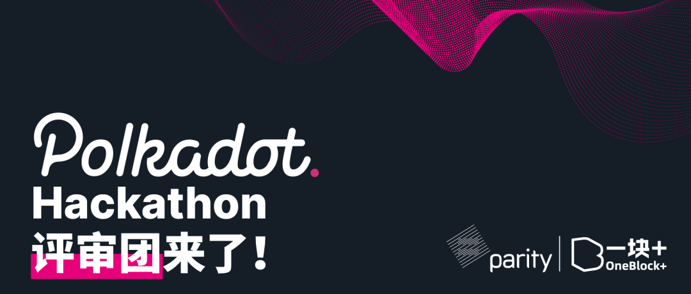
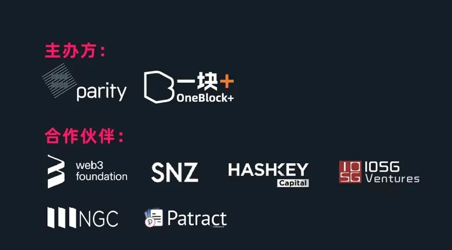

# Polkadot Hackathon 豪华评审团19位导师公布！

[微信原文](https://mp.weixin.qq.com/s/D4ZNY7atLpWXZpe7s66MXw)

## 目录

  
点击打开看目录

<!-- MarkdownTOC -->

- [评委团](#%E8%AF%84%E5%A7%94%E5%9B%A2)
- [观察团](#%E8%A7%82%E5%AF%9F%E5%9B%A2)
- [来自评审团的期待](#%E6%9D%A5%E8%87%AA%E8%AF%84%E5%AE%A1%E5%9B%A2%E7%9A%84%E6%9C%9F%E5%BE%85)
- [Hackathon 常见问题解答](#hackathon-%E5%B8%B8%E8%A7%81%E9%97%AE%E9%A2%98%E8%A7%A3%E7%AD%94)
- [Hackathon 奖金池](#hackathon-%E5%A5%96%E9%87%91%E6%B1%A0)
- [Hackathon 参赛者报名入口](#hackathon-%E5%8F%82%E8%B5%9B%E8%80%85%E6%8A%A5%E5%90%8D%E5%85%A5%E5%8F%A3)
  - [Step1](#step1)
  - [Step2](#step2)
  - [报名时间](#%E6%8A%A5%E5%90%8D%E6%97%B6%E9%97%B4)
  - [报名流程](#%E6%8A%A5%E5%90%8D%E6%B5%81%E7%A8%8B)
  - [重要时间安排](#%E9%87%8D%E8%A6%81%E6%97%B6%E9%97%B4%E5%AE%89%E6%8E%92)

<!-- /MarkdownTOC -->

Polkadot Hackathon 是首届 Parity 官方 Substrate 开发者黑客马拉松创业大赛，由 Parity 与 OneBlock+ 社区共同主办，IOSG、SNZ、Hashkey、NGC、Patract 联合发起。

这一次，我们将招募面向中国的 Substrate 技术爱好者用户参赛，希望能够通过 Hackathon 的形式，**100 余位开发者们在 52天内** 可以之前所学的基于 Substrate 框架理论知识与实战开发相结合，在波卡生态中能够创造出更多创新型的产品。 **优胜团队将获得丰厚的奖金和技术、资源支持，真正意义上的成为波卡生态的一员。**

Polkadot Hackathon 组委会很荣幸地向大家介绍本次黑客松比赛的评委嘉宾。**19位评委由技术大咖、国内顶级机构投资人、媒体及社区领袖构成，全方位帮助Substrate生态开发者实战成长，共同发掘波卡生态最新价值项目。**

## 评委团

## 观察团

## 来自评审团的期待

**Yaoqi @Parity 亚洲负责人**

基于 Substrate。我们希望申请项目和团队计划在 Substrate 构建系统或产品，同时未来打算长期在 Polkadot 的生态上发展，并连接到 Polkadot 做为平行链或者平行线程。

重在创新。在区块链行业，投资机构和社区对于项目的创新性是十分挑剔的。新颖的创意会吸引大量的社区成员参与和投资。

有代表性和不可或缺性。我们欢迎团队探索不同的赛道，做出有代表性或者是目前Polkadot/Substrate所缺少的项目，例如去中心化存储、去中心化计算、隐私保护、开放式金融、身份认证、社交网络、媒体广告、游戏等等。

**Jocy@IOSG Ventures 创始人**

Polkadot和Kusama今年在整体代码进度完成度极高，是为数不多能在 DeFi 大火后，仍能在以太坊世界之外成为市场焦点的方向。

作为一个异构分片多链网络，利用Substrate的开源开发框架让同源协议相互桥接，让最终用户更方便的访问整个异构区块链生态系统。

此外，Polkadot今年的平行链拍卖，也是一场更公平的治理活动。Polkadot如何兼容以太坊世界度DeFi和交易，我们也看到非常多的开发团队致力于此。

我们认为，只有足够丰富强大的生态项目能在Polkadot的去中心化体系内良好的交互起来，才能发挥该系统真正的潜力。因此，我们期待在生态上发现更多专注于特定专业领域的原创性项目，助力生态长久的协同建设。

**岳利鹏 @Patract 创始人**

区块链行业近5年来产品方面的发展大部分被以太坊生态所占据，开发者和用户对区块链产品的理解也快形成思维定式，而以太坊产品的形态一定程度上是由于其合约模型和合约表达能力的限制。面对新诞生的Substrate链框架和新WASM合约模型，开发者可以使用新式发动机更换产品引擎。

希望开发者能跳出以太坊产品现状，开发出能够发挥Substrate链开发或WASM合约开发先进性的项目，而不是以太坊产品或合约的翻译版。

## Hackathon 常见问题解答

上周开启了黑客松报名后，我们收到很多开发者的私信，在这里列出了一些常见问题，统一解答下大家关于比赛的疑问。

Q1：独立开发者可以申请一个人组队吗？

> 可以。任何一个开发者都可以申请。但一个人参赛可能会比较困难，因此我们建议你找到团队一起协作的小伙伴，这样更容易取得成功。

Q2：报名队伍只能是2-5个人吗？

> 根据以往黑客松的经验，我们比较建议大家组成2-5个人的团队进行协作，但不做强求，你也可以是1个人或者是5个人以上。

Q3：没有上过Substrate开发课程，是否可以报名？

> 可以。任何一个有Substrate开发经验的开发者我们都欢迎大家踊跃报名，并且在比赛期间我们邀请到多位Substrate技术大牛以及Parity官方工程师每周定期举办 Workshop+Office Hour， 深度技术指导与答疑直播，欢迎大家关注# OneBlock 社区公众号获取最新直播排期。

Q4：我有一个很棒的想法，但是我没有Substrate开发经验/任何开发经验，我仍然可以报名这次黑客松比赛吗？

> 对于黑客松比赛而言，参赛者需要有开发经验，如果你有开发经验但是还没有学习/使用过Substrate，我建议你可以快速花几天时间了解Substrate，再决定你是否需要报名。想了解更多 Substrate最新信息，欢迎访问：https://substrate.dev/

Q5：我可以同时参加 2 个队伍比赛吗？

> 理论上我们是不限制的，但是不推荐你这样做。你应该选择最想做的项目来申请这次比赛。

Q6：我们可以作为投资机构加入奖金池，继续为这次活动提供奖金吗？

> 非常抱歉，我们本次黑客松的投资机构奖金池名额已经完全确定不再更改与增加了。但是，在2021年的每个季度，我们都将举办一次黑客松比赛，如果感兴趣的机构依然可以与我们联系，欢迎来申请下一次6月份举办的黑客松投资机构合作伙伴。

Q7：这次黑客松是线上还是线下？

> 本次黑客松活动我们采用线上和线下结合的形式，线上52天（1月29日-3月19日）备赛，线下2天（3月20日-3月21日）现场比赛及demo演示。

Q8：我不是参赛者，我可以作为观众参加这次黑客松比赛吗？

> 线下 Demo Day 将于3月21日下午在上海市长宁区举办，我们将仅开放50个现场观众席位，请填写：https://shimo.im/forms/w6HH6vp9VVD6wgW3/fill Polkadot Hackathon 观众报名表，并添加jessie微信（yikuailianxi ），我们将在7个工作日内通知你是否被通过审核的最新消息。

Q9：我们团队是否需要每个人都填写报名表？

> 需要。为了方便我们参赛人数的统计以及预约电话面试，请务必每个参赛者都填写报名表，填写完毕后请主动添加jessie微信（yikuailianxi），我们将立刻邀请你加入参赛群，获取关于比赛的重要事件通知。

Q10：我报名以后，大概什么时候会收到电话面试邀约？

> 在你填写报名表并添加jessie微信后，我们会将你邀请加入参赛者群，并于5个工作日内在参赛群内通知大家电话面试具体时间安排。

## Hackathon 奖金池

##  Hackathon 参赛者报名入口

还在等什么，抓住最后等机会，长按识别下方二维码，填写并提交报名表即可申请「Polkadot Hackathon」。我们接受团队或个人报名。

### Step1

点击下方二维码即可报名，报名截止日期为 2 月 11 日 24：00。

**报名方式一：团队报名**

2-5 人团队参赛

**报名方式二：个人报名**

个人报名在通过筛选后将在线组队

注：

* 参赛完全免费，但因名额有限，参赛者需预付 99 元作为到场保证金，到场返还。
* 未通过筛选的报名者将收到全额退款。
* 若通过筛选报名成功者不能到场，保证金不退还。

### Step2

提交报名表后，请添加 jessie 小姐姐微信（yikuailianxi），小姐姐会安排大家视频面试的时间以及付款99元到场保证金，祝大家成功！

### 报名时间

2020 年 1 月 29 日 - 2021 年 2 月 11 日

### 报名流程

填写申请表 → 电话面试 → 组队 → 备赛

### 重要时间安排

想了解更多 Hackathon相关信息，欢迎访问详细介绍：[首届 Parity 官方 Substrate 开发者黑客马拉松报名开始了！](./01-announcement.md)
