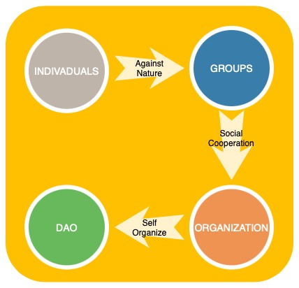

# How will organization evolve in the next decade?
# Our Vision and Mission

As the global economy has recently suffered one of the few recessions in its history, Bitcoin has made its way to upend the perceptions of the nebulous, showing the world what it was created for and all the dirty deals in this world.

Whether you are enthusiastic or disgusted, blockchain has become an inescapable topic for all. Over the past decade blockchain technology has been slowly growing in its gestation, subtly influencing the development of human society in many ways. In addition to bringing new changes in the financial field, the application of tbing.cblockchain technology has also given a huge impetus to the change of organizational forms. With the development and maturity of blockchain technology, the new form of organization, DAO (decentralized self-governing organization), has gone from obscurity to the preferred form of governance for most blockchain projects and thus formed a difference from traditional centralized organizations.

While centralized organizations are formed in the struggle between humans and nature, decentralized autonomous organizations are built based on replacing trust between humans with machine trust. Both forms have their advantages. How will the future of human social organization be constructed? Will it is optimized and improved based on the current centralized organization, or will it adopt the decentralized autonomous organization form to coordinate everything? This is the question we are thinking about now at the crossroads of the times.

Figure 1 Centralized Organization -> Decentralized Organization

Any organization is a system that brings people together to do specific things to achieve the organization's goals. There are four elements, namely, people, system, motivation, and affairs. From the dimension of these four elements, decentralized autonomous organizations differ greatly from centralized organizations. In a centralized organization, people join as employees, the system is a hierarchical management mechanism of leading and being led, and the affairs handled are fully in line with the demands and interests of the organization or management, and the motivation is to maximize profit or organizational revenue. In a decentralized organization, anyone can join and withdraw from the organization, and the people in the organization can vote democratically to achieve equality in decision-making, and the matters handled are in line with the demands of the majority of people in the organization and the wishes of the executors.

With the help of blockchain technology, the decentralized organization is free from human interference in its self-governance, avoids power rent-seeking, fully practices democratic governance, promotes diversity in the organization with open and transparent incentive mechanisms, enhances the motivation of participants, and can adapt to different scenarios of transaction processing.

Excluding human interference to fully practice democracy in a huge crowd is not only needed for blockchain projects, but also foropen-source organizations, corporate organizations, and social governance. Decentralized organizations will co-exist with centralized organizations in the short term in the next decade and occupy an increasingly important position, so much so that they will replace centralized organizations as the ultimate form of all organizations in the far future. The future of life will be connected to decentralized organizations everywhere, but at present, decentralized organizations are not yet known by the general public, and their tools for organizational governance are relatively lacking and fragmented.

Currently, there are some DAOs on the blockchain, most of which have their own governance schemes and systems, such as MakerDAO, TheLAO, etc. They have developed their own systems for governance. TheLAO, on the other hand, has developed a voting contract directly on Ether to voting on investment projects. Other organizations have developed basic DAO governance toolchains, such as Aragon and DAOHaus, which abstract the common functions of the DAO governance process and provide functions such as voting and fund pool management. DAOHaus, on the other hand, provides functional contracts for voting and fund management on Ether, as well as an attractive front-end and other tools to help DAOs with governance.

Developing their own governance tools is not something that every DAO can implement, and only those organizations with sufficient R&D capabilities or initial capital reserves can afford to do so, so it is not practical for smaller organizations or those without capital reserves to develop their own governance tools. The current toolchains and systems for DAO governance can meet the most basic needs of governance, i.e., voting and fund management, but other common needs, such as the combination of multiple decision-making forms, automated execution of governance behaviors, daily community governance communication, etc., are difficult to meet, and only some systems have open interfaces to customize personalized needs, and the technical requirements for personalization are extremely high. The technical requirements for customization are so high that it is almost impossible for small and medium-sized organizations to achieve.

For a DAO of any size, a rich and complete DAO governance toolchain is the foundation for a sustainable DAO, a simple and easy extension is the way to diversify the DAO, and a friendly peripheral tool is the gas pedal for the DAO to penetrate every aspect of human life. The SubDAO Network was created for this purpose, and we will provide all DAOs with the toolchain they need to govern!

Our vision is to integrate DAO governance into every aspect of life, to put everything under the sun, to eliminate the oppression of power, to remove the shackles of class from everyone, to let everyone face their freedom, to let everyone express their opinions freely, to choose their own choices, to let democracy be truly practiced! Fuck pseudo-democracy!

# SubDAO Network

SubDAO Network is a Polkadot-based DAO management platform developed using the Substrate framework, providing a chain of tools from creation, funding pool management, voting to personalization to assist DAO creators and participants in the governance of their organizations. With SubDAO Network, DAO creators can build DAOs quickly and easily, and learn to personalize them easily.

Figure 2 Structure of SubDAO Network

The SubDAO Network consists of four parts: SubDAO Node, SubDAO Airfone SDK, SubDAO Smart Contract, and SubDAO App front-end.

* The **SubDAO Node** is a blockchain node developed using Substrate. It carries the blockchain node capabilities and also provides off-chain data access, and is the foundation of the SubDAO Network
* **SubDAO Airfone SDK** is a set of SDKs to provide developers with links to the DAOs in the SubDAO Network, providing a DAO governance interface wrapper that allows developers to easily and quickly integrate DAO governance capabilities into applications on the web, iOS/Android mobile devices, and PCs.
* **SubDAO App Frontend** is the plane for users to interact with the DAO, and participants of the DAO through the SubDAO App Frontend can directly participate in the governance of the DAO.
* **SubDAO Smart Contract** is the core of the DAO's governance capabilities. Through smart contracts, the governance behavior of the DAO can be guaranteed in a loose schedule without worrying about human interference in the governance behavior. There are several components in SubDAO smart contract, namely Template Library, Asset Vault, and SubDAO Guard.
    * **Template Library** is the core component of SubDAO smart contract, which consists of the main smart contract and several smart contract modules. Its main function is to provide and manage a variety of DAO organization templates for various common organization forms and provide modules that can be customized to allow DAOs with certain R&D capabilities to define new modules as needed.
    * **SubDAO Guard** is the component that manages the functionality in the SubDAO Network. All governance actions for the SubDAO Network are performed through the SubDAO Guard component, such as modules added to the SubDAO Network, adjustments to the functionality of the SubDAO Network, etc.
    * The **Asset Vault** component is the asset management component that provides the DAO within the DAO. All assets coming across the chain via Polkadot and other chain bridges and other assets on the chain are managed by Asset Vault.

Initially, SubDAO Network will provide some of the features commonly used in various DAO governance, and standardize them into DAO templates so that people can easily and quickly create and participate in DAOs later. We will gradually provide DAO-based company templates, non-profit templates, government templates, educational templates, club templates, venture capital fund templates, voting templates, fund management templates, and basic templates so that as many organizational models as possible can be supported by SubDAO, and provide DAO participants with the ability to customize their templates.

Our idea is simple and naive, and the SubDAO Network has already taken its first steps, starting from scratch, like a boat that has set sail towards a historical milestone.

# Future Plans

We will provide the tools of DAO governance to those who are already familiar with and know that DAO will be the future form of organization, and we will open the door to DAO for those who know nothing about DAO!

In the future, we will build on the existing DAO system and provide an entry point into the existing Web 2.0 world.

The following ideas and plans are already in place, so if you are interested in our ideas, please follow or join us!

* **Provide the world with an open and free decentralized arbitration court**

Let anyone who is unfairly treated find a way and a channel to complain in this world, openlypractice the earthly truth, say goodbye to those puzzling legal trials and those money transactions that cannot be seen, and let everyone be treated well.

* **Provides a reputation-based lending platform based on individual, organizational behavior in DAO governance**

Based on the individual, organizational behavior in the on-chain governance process in SubDAO Network to provide a lending platform based on thepersonal credit, to hell with those so-called collateralized lending, your credit will be your asset, not those houses, and cars that are considered by banks to be crowned.

* **Imbedding the DAO governance process in social platforms**

Whether people who already know something about DAO or people who know nothing about DAO need to see it in their most convenient life tools and be able to participate in it anytime, anywhere, we will embed SubDAO in social platforms to make SubDAO reachable.

* **Build a truly decentralized communication platform for DAO organizations**

A secure, decentralized, and unregulated communication platform is a necessary choice to eliminate violent coercion.

More ideas are in the works, and we look forward to hearing from you if you love DAO and want to contribute your passion to our cause!

# Thank you

**Thank you to every brave person who stands up and makes a difference in the world!**  

**Thank you to every martyr who has fought and died for democracy and freedom!**  

**Thank you to everyone who has supported the SubDAO Network in its progress, friend and foe alike!**  

# At the last

**Ask me, you will always hear the answer you know**  

**Look at me and you'll always see the choices you expect**  

**Can't breathe, can't express, can't choose**  

**Beneath the mask of your oppression**  

**we will finally choose the organization you have ever feared**  

**We will say goodbye to the hypocritical democracy**  

**We will choose to build a new world**  

*This article can be found [here](https://subdao.medium.com/subdaos-viso-how-will-organizations-evolve-in-the-next-decade-db0883ff290d)