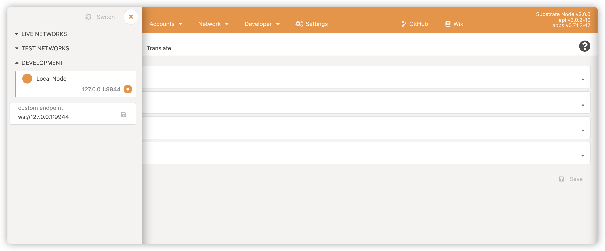
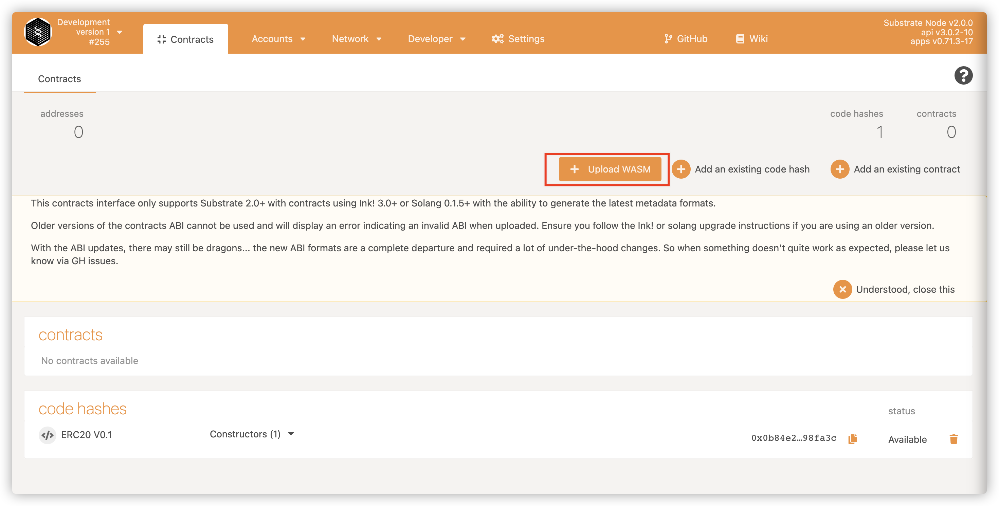
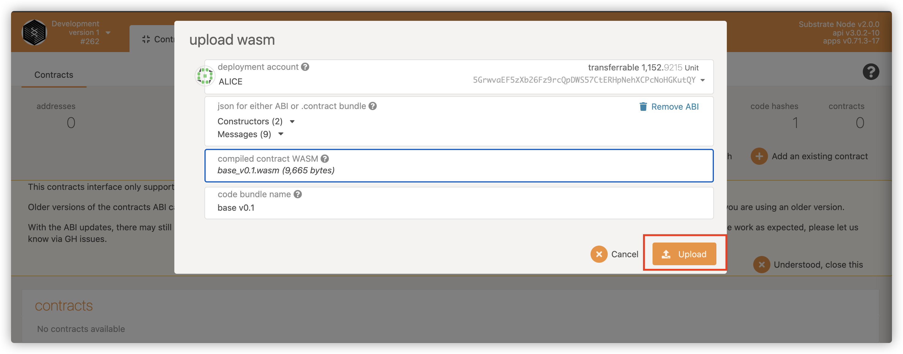
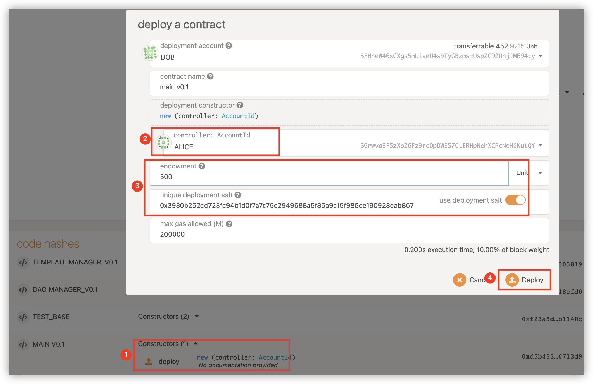
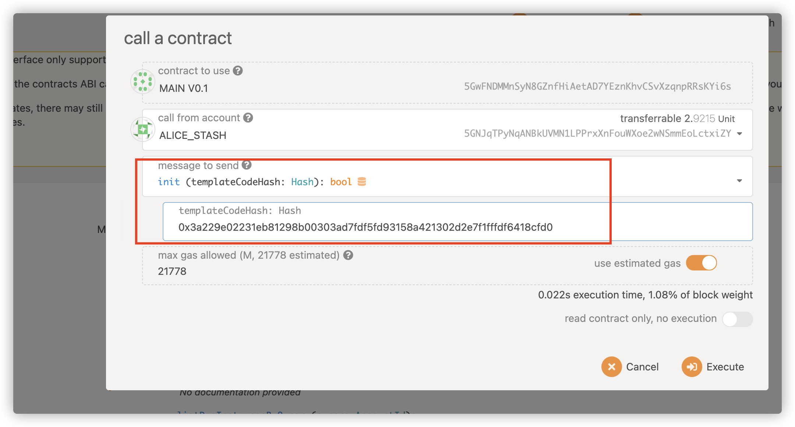
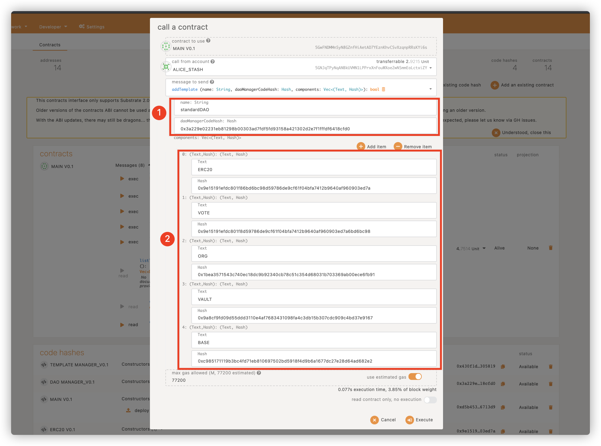

# Setup SubDAO Node

## Build from source
```
git clone --recursive https://github.com/SubDAO-Network/subdao-node.git
cd subdao-node
cargo build
```

## Setup with Docker
Docker Image: [here](https://drive.google.com/drive/folders/1VRm0puMeYOj6c8hHGNlKmZZyN9D8mo-v?usp=sharing)

## Compile Contracts

SubDAO provides scripts to simplify the contract compilation process while collecting the editing results into a unified directory to facilitate contract deployment and usage. Execute in the project root directory

```bash
bash ./build.sh
```

All contract compilation results are saved in the release directory.

## Deploy

TheSubDAO creates the substrate chain to connect the POLKADOT Ecology, and all contracts are deployed on the SubDAO chain. This section explains how to make use of PolkadotJSAppto deploycontracts.


Download and compile Polkadot JS Apps code, followed by yarn start startup. Access the front page http://localhost:3000/ and set the node IP and port.




### Deploy Contracts

Enter developer-> Contracts and click Upload WASM.



Select the ABI and WASM files that require the deployment contract, click Upload, and Submit and Sign.



Wait a moment and the contract code will be uploaded.

### Deployment contract

After you upload the contract, you can instantiate the contract on the chain. In substrate, you need to perform the contract’s initialization function, usually new or the default function.

ForSubDAO contracts, all contracts are instantiated by the main contract. So the only contractSubDAO really needs to be deployed is the main contract. The main contract is responsible for managing contract templates and Dao instantiations.




Select the initialization function call, fill in the initialization parameters, set the main contract administrator, and set the contract initial balance, click Deploy. Note that the deployment salt is used.


## Initialization

### Initialize main contract

The main contract manages the DAO templates and DAO instantiations. After the main contract is deployed, you need to initialize the template management function of Main, call the init function and set the code hash of the contract template manager.




### Add templates for DAO

For now, Dao templates can only be configured in the tool by calling the `addTemplate` function in the main contract, fill in the creator accountid and the code hash for each components in the template.

For example, we create a DAO template with vault management, DAO tokens, org management, voting, and also the basic information for the template.

After adding the DAO template, you can happily create the DAO  through the SubDAO frond-end. Jump to the frontend which is served at `http://localhost:3001/`.




### Creating DAO

After you create a template, you can create your own DAO from the template that you have set up.


### Have fun!
