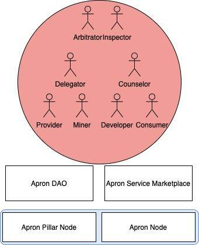
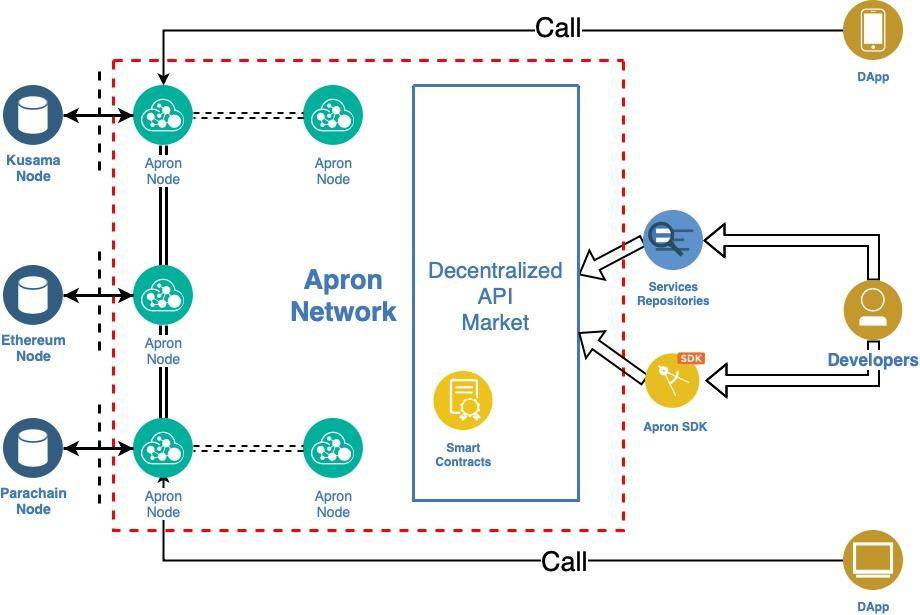
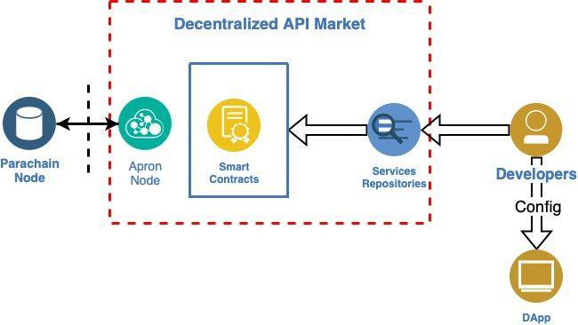
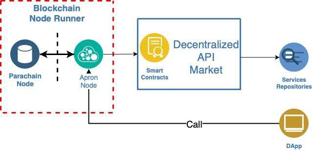

## Background and Overview
With the development of Ethereum and the enhancement of the smart contracts, an increasing number of developers are getting involved in the construction of an open-source community, and are realising their ideals using smart contracts. Since the Ethereum Network launched, DApps have exploded in popularity. As of December 1st, 2020, there have been  a total of 14,161 smart contracts executed and 5,714 DApps deployed on Ethereum with daily volume reaching upwards of $1.2 billion.

Operating Ethereum nodes has always been an expensive and energy intensive task. Initially, most Ethereum nodes were able to provide public services for the community. Now, however, most Ethereum nodes are exclusively serving the specific business interests of operators. Due to the restrictions of public operation and maintenance costs, and the lack of an ecosystem for Ethereum node service operators to find corresponding community developers, fewer and fewer Ethereum node operators are willing to make node services public. Consequently, it has become increasingly difficult for DApp developers to operate an Ethereum node or find a stable and usable Ethereum node service.

By offering this basic-level service, DApp developers now have the opportunity to create their applications. Following this, a small number of companies that can provide Ethereum node services have gradually emerged in the ecosystem. For example, Infura (infura.io), funded by Consensys, is the largest Ethereum node service provider in the world that provides basic Ethereum node services to millions of developers. DApp developers invoke the Ethereum API service provided by Infura in their own code, so that their Applications have access to everything on the Ethereum network. So far, most of these applications are extremely dependent on the Ethereum node service of Infura including some leading companies in the blockchain field. 

On November 11, 2020, the fundamental issue with this centralized support structure revealed itself when the Infura node network failed and became completely inaccessible. Not only did this failure affect a wide range of applications, services and exchanges in the immediate aftermath, but it also harmed user confidence that these services could be relied upon in the future. This was perhaps one of the most influential events in the history of the blockchain which served to highlight the absolute necessity for decentralized infrastructure.

Our team at Apron Labs had been developing dApps in the Ethereum ecosystem and experienced this catastrophe first hand. From then on, we vowed to overhaul the archaic and centralized service network and created the solution, Apron Network.

In order to solve the problems of infrastructure Service Discovery, Service Call and Service Billing, Apron Labs proposed Apron Network as a solution to improve the infrastructure service ecosystem of the Web 3.0 world. The Web 3.0 era makes it possible for developers to freely provide and use any infrastructure services, which will connect the real world to the Web 3.0 world and return freedom to the individual.

## Architecture and Design
Apron Network is based on the Substrate framework and can be a parachain of both Kusama andPolkadot. The nodes running in Apron Network are divided into two types: the Apron Pillar Node and the Apron Nodes. In addition to the nodes[On the nodes which are able to run, Apron DAO will manage Apron Network. The entire Apron Network will be composed of the Apron Pillar Node, the Apron Nodes, Apron Service Marketplace and Apron SDK.

The roles involved in the network construction include Providers (service provider), Miners (node miner), Delegators (client), Arbitrators (arbiter), Inspectors, Consumers (user), Developers (service developer) and Counselors (service consultant). All of the network construction roles work together through Apron DAO to ensure the stable and continuous operation of the entire Apron Network.

- Apron Pillar Node

The Apron Pillar Node is developed on the Substrate framework, which provides a security guarantee for Apron Network and ensures the stable operation of the network. It is the basic network node of Apron Network. The Apron Pillar Node will be initially launched by Apron labs and will be run by community participants.

- Apron Node

Apron Network is made of Apron Nodes, which are based on the Substrate framework with OCW (off-chain worker) enabled. The basic service providers provide service publicly through thean Apron Node, which synchronizes the basic service upon-chain, and synchronizes the information of service usage and billing on the chain through thean OCW module.

Any infrastructure service provider can provide its infrastructure services to the public through Apron Node. Whether it is a block link point operator or a provider of information technology services in the traditional Internet and other fields, all you need to do is to deploy the Apron Node in any network that can connect to the Internet and access your own infrastructure services, which are provided to the public. By adding the corresponding service information to the configuration, it allows the public to discover and use the infrastructure services while also receiving service usage fees. Individuals, teams or companies that have been or will be able to provide infrastructure services can become Apron Network participants. They will also be able to provide infrastructure services for the Apron Network and the Web 3.0 world and obtain corresponding benefits by running Apron Nodes.

- Apron Service Marketplace

Apron Service Marketplace matches the services provided by infrastructure service providers with the needs of DApp developers. Infrastructure service providers can implement up-chain infrastructure services by deploying an Apron Node with one click. The Apron Node will provide infrastructure services to the Apron Market smart contract through OCW, and synchronize the infrastructure service usage data into the smart contract. The Apron Market smart contract will also charge for the service usage.

The Apron Market smart contract will use the data provided by OCW to calculate the revenue obtained by the infrastructure service provider and deduct the usage fee that should be paid by the service user. Apron Market is not only a smart contract, but also a web-based service discovery platform. Service users can search for the infrastructure services they want to use on Apron Market, and they can also post their infrastructure requirements on Apron Market to find a match between demand and supply.

- Apron SDK

The Provider (service provider) is a provider of infrastructure services. It provides its capabilities to developers and users through Apron Node and is one of the key participants of Apron Network. Any person or organization that can provide services can become a Provider on Apron Network.

The Miner (node ​​miner) is important to the maintenance of Apron Network. It runs Apron Node to ensure that the services provided by the Provider can be used, and obtains rewards by maintaining the network at the same time.

The Delegator (client) does not directly participate in network construction. Instead, it will provide tokens to the miner, provider and other roles for the pledge, assisting the Provider and Miner to participate in the network construction and obtain profits from it.

The Arbitrator (arbiter) will resolve the conflicts or request for arbitration on the network in the decentralized arbitration court, which is an important part of the DAO..

The Inspector supervises the operation of the registered services on the network and inspects the registered services in the meantime. If problems, such as technical issues or spam that appear in the service, the Inspector will provide information to the Arbitrator and request for arbitration. When someone else requests for dispute resolution, the Inspector will provide relevant information to the Arbitrator so that they can assess the case.

The Developer (service developer) is one of the key participants of Apron Network, creating applications based on the infrastructure services existing on Apron Network and paying service usage fees to service providers. 

The Counselor (service consultant) assists the Provider to register infrastructure services on Apron Network, check service statuses and initiate requests to include the services provided by the Provider on Apron Service Marketplace. The Counselor will also score and rank the services on the Apron Service Marketplace according to the statistical data, so as to provide references for developers who would like to select infrastructure services.

The Consumer is the user of the service.

- Roles

The Provider (service provider) is a provider of infrastructure services. It provides its capabilities to developers and users through Apron Node and is one of the key participants of Apron Network. Any person or organization that can provide services can become a Provider on Apron Network.

The Miner (node ​​miner) is important to the maintenance of Apron Network. It runs Apron Node to ensure that the services provided by the Provider can be used, and obtains rewards by maintaining the network at the same time.

The Delegator (client) does not directly participate in network construction. Instead, it will provide tokens to the miner, provider and other roles for the pledge, assisting the Provider and Miner to participate in the network construction and obtain profits from it.

The Arbitrator (arbiter) will resolve the conflicts or request for arbitration on the network in the decentralized arbitration court, which is an important part of the DAO..

The Inspector supervises the operation of the registered services on the network and inspects the registered services in the meantime. If problems, such as technical issues or spam that appear in the service, the Inspector will provide information to the Arbitrator and request for arbitration. When someone else requests for dispute resolution, the Inspector will provide relevant information to the Arbitrator so that they can assess the case.

The Developer (service developer) is one of the key participants of Apron Network, creating applications based on the infrastructure services existing on Apron Network and paying service usage fees to service providers. 

The Counselor (service consultant) assists the Provider to register infrastructure services on Apron Network, check service statuses and initiate requests to include the services provided by the Provider on Apron Service Marketplace. The Counselor will also score and rank the services on the Apron Service Marketplace according to the statistical data, so as to provide references for developers who would like to select infrastructure services.

The Consumer is the user of the service.

- Apron DAO

Apron DAO is the governance organization of Apron Network. Members of Apron DAO will be participants from the Apron Network community, including the members of Apron labs, community developers and contributors, application developers, users and Apron Network asset holders. Apron DAO will make decisions on the future development plans of Apron Network, the functional development progress of Apron Network, the upgrade of the Apron Pillar Node and the community promotion scheme. On top of this is a decentralized arbitration court run by Apron DAO members, which will settle the disputes between all parties in the Apron Network and maintain its stable development. The founding node in Apron Network will first be operated and maintained by Apron labs. From there the responsibility for operation and maintenance will be passed on to the community through community governance.

- Scenarios

The decentralized infrastructure service market based on Apron Network consists of three parties. These are the infrastructure service providers, the DApp developers and the Apron Network Builders. Infrastructure service providers have infrastructure service capabilities, which need to be transported to the market for the use of the Developers. DApp developers are application developers and application development relies on infrastructure services. As DApp developers themselves may not have the resources to develop corresponding infrastructure services, they are required to find the infrastructure services elsewhere. Apron Network builders are mainly the operators of the Apron Nodes. In Apron Network, the identity of the infrastructure service provider and Apron Network Builder can overlap.

The decentralized infrastructure service market consists of two main parts: the Apron Market smart contract and the Apron Market front-end. The Apron Market smart contract is a smart contract that is at the core of the Marketplace. This smart contract deals with the requests to the infrastructure service up-chain, discovery, calling and billing. The market front-end provides market information display, queries, developer information maintenance and other auxiliary functions on the network.

- Service Registration

After connecting to Apron Node, the infrastructure service provider can register all the available service information on the Apron Service Marketplace, including call modes, access addresses, fee descriptions and permissions. All service-related information is recorded by the Apron Service Marketplace, and the service information is presented to all developers and users on the front-end page. Any call information regarding infrastructure services will be transferred to to the chain through the Apron Node. 

- Service Discovery

It is very important for both Providers and Developers to find each other in the market. In the Apron Service Marketplace, all infrastructure services are presented to service users on the front-end pages. Developers can also retrieve corresponding services in the market or offer a reward to find service providers that fit their requirements.

Apron Network will search and check the status of infrastructure services in all markets by introducing the role of the Inspector, providing relevant service information to users on Apron Network and offering a reference for the dynamic balance functions in the Apron SDK.

- Service Calling

After the application has been developed, Users use the Apron Node to invoke the services in the application.

As is shown in the figure, all applications call the services provided by the service provider through the Apron Node. The Apron Node provides service call modes including JSON RPC, RESTFull API and GraphQL. Developers can choose the appropriate service call mode in different scenarios.
- Service Billing

Every service call is recorded by the Apron Node.  The Apron Node will aggregate the service call information then synchronize it to the chain through the OCW feature when it reaches a fixed point. The pricing information of the services is available on Apron Service Marketplace, and the service usage fee will be calculated based on the pricing information, service call times and service caller information. The developer will pay the usage fee to the service provider based on the billing information. If the Developer discovers a problem with the service or the billing information, the Developer can request arbitration with the DAO's central arbitration court and ask the service provider to compensate for losses.

- Service Ranking

The ranking rules are introduced into the Apron Service Marketplace, and services are automatically evaluated from multiple angles by the Inspector and the Counselor. The current frequency of calls is the main measuring criteria. If the current service node is called too few or too many times, its ranking will be affected. When the number of calls is too high, the system will reduce its time of display and ranking. We hope that each service node can maintain a steady frequency of calls. The service will be excluded from the leaderboard when the service is unavailable. The ranking list serves as a way to recommend infrastructure services to DApp developers, making it more convenient for DApp developers to quickly find the infrastructure services they need in the market without taking their DApps off-shelf or banning any infrastructure services.

- Service Penalty Policy

The Inspector is responsible for checking the services in the network. When an infrastructure service provider or an infrastructure service user has been found to have acted maliciously, the Inspector will automatically request for punitive action to the DAO. Members of the DAO will then assess the incident and if the Inspector is found to be correct, action will be taken. When the decentralized arbitration court deems the Inspector to be correct, a portion of the fine will be delegated to the Inspector.  The same set of rules apply to the infrastructure service provider in the case that they come across malicious behaviors.

## Current state

We did researches and tests with Substrate Framework in Jan 2021, and started the coding work from Feb 2021.

Currently we finished the POC version and tried to provide free node RPC services for Heco and BSC to verify our idea. Now the free node RPC services are published as test version.

What we have done now:

* Customized Substrate Node Alpha version
* Simple Marketplace by ink! contracts
* A self developed gateway

## The challenge and solution

#### 1. How to solve the problem of Billing. 

It's very hard to provide billing through blockchain, because it's not possible to know how is the usage status of an API service by a developer. After a long time of investigation, we think, the key point would be component which serve the API. So we figured out to build a our own gateway from scratch which is can be integrated into the blockchain node. Then we built one.

#### 2. Pallet vs Contract

Pallet is well known in Substrate world. While smart contract is what we see for the first sight when we meet the development on blockchain. Pallet is quite easy to be used and well designed. We donot which one should be choosed. So we paid lots of time on learning both. Finally, we decided to use contrat, because pallet is good enough to customize a chain with proper functions but contract will give more freedom to third party developers.

#### 3. How to choose the proper smart contract solution

At the begining, we donot know which is the proper way to build smart contracts Solidity or ink!. And we wasted 3 weeks on investigating Solidity solution on Substrate. We have tried Frontier, Solang, most of the test cases are passed, only few key features are not satisfied. So we move to ink!. And we implement the whole project with ink! again, but fortuntely, there is not so much code yet.