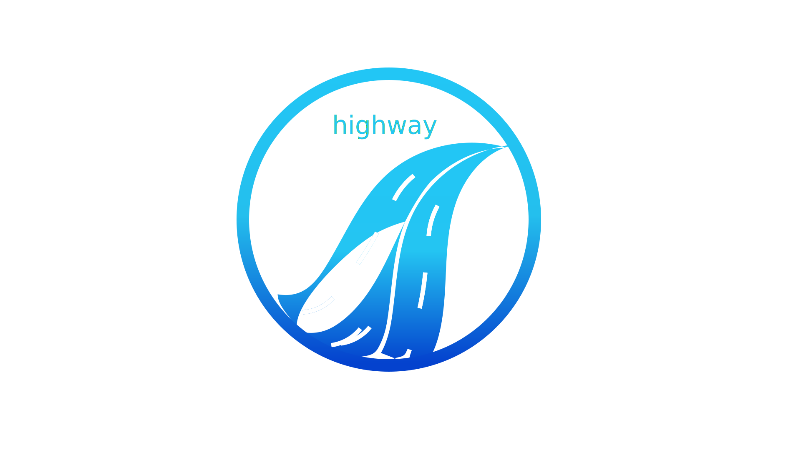
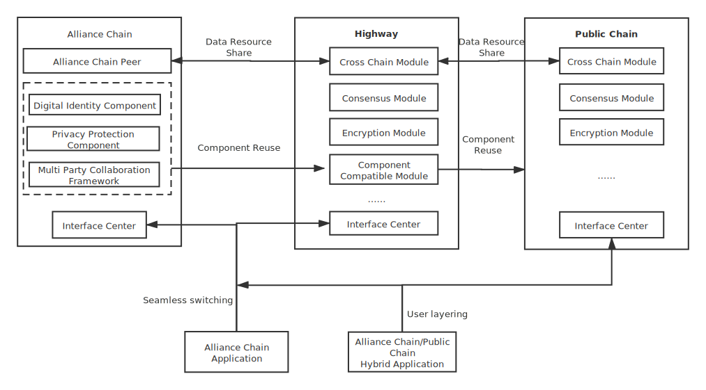

English / [中文](./project_CN.md)

# Highway

## Background

In recent years, China has taken the blockchain as an import breakthrough for independent innovation of core technology, and encouraged to exploration of blockchain plus model, so as to promote the innovation and development of blockchain technology and industry, and promote the deep integration of blockchain and real economy. Alliance chain not only has the characteristics of public chain, such as non-tampering, decentralization, forensic, traceable, etc., it also includes a limited centralized management mechanism to improve the operability and supervisability of the entire system. It will play a huge role in the fields of digital finance, government transportation, culture and health, intelligent manufacturing, supply chain management, digital identity, etc.. It also provide new power for building the industrial internet and promoting the transformation and upgrading of traditional industries.

At present, there are several platforms for alliance chain, such as Hyperledger Fabric, R3 Corda, FISCO BCOS, etc.. Although they have their own characteristics, and also solve the unique problems in the alliance chain, such as identity authority management, data privacy, etc.. However, due to the different technical selections of these platforms, components with the same function (such as identity authentication) need to be implemented on each platform, which causes a lot of waste of resources, and when users need to replace encryption, consensus and other algorithms for policy reasons, the cost of the transformation will be very huge.

Enterprises may need to cooperate in data sharing, online collaboration for business development. If these enterprises alerady have some business accumulations with blockchain, as they choosed different alliance chain platform, these businesses will become data islands, to break the data islands, most enterprises can't afford the resources they need to invest.

We believe that the public chain has realized the Value Internet through token transmission, while the alliance chain is just a supplement to the traditional Information Internet. We also firmly believe that the Value Internet will replace the Information Internet one day. But it is still the future, the future needs a bridge to connect to the real world. From the DECP released by the People's Bank of China, we can see the hope of bridging the future with reality.

We want to catch the revolution of economic and technological that is quietly happening in China and the world, and create a simple, easy-to-use, open, shared and win-win alliance chain platform similar to the Chinese highway system (so our alliance chain platform called highway) to provide the power of the realization of a distributed society.

## Architecture

## Process

* Completed the basic group architecture design, realized a simple blockchain network with groups as the unit, and verified its feasibility with the actual deposit application (Visit [https://elixir.leeduckgo.com/](https://elixir.leeduckgo.com/) to explore, Username: highway, Password: leeduckgo).
* Implemented some basic chain management tools, let users use and manage blockchain networks at low cost (unnecessary to understand or learn any related technologies).

## Technical problems encountered

* Problem: The program is abnormal due to Substrate upgrade. Solution: Ask for help form community or view the source code.
* Problem: Substrate or polkadot-js documents are not updated in time, resulting in program exceptions. Solution: Ask for help form community or view the source code.

## Planning for one year

### Phase 1: Be Born

* Time schedule: 1-2 quarters.
* Release Highway V1.0.0, it will comply with [Financial distributed ledger technology security](https://www.cfstc.org/bzgk/gk/view/bzxq.jsp?i_id=1855), and provide component (such as identity authentication, authority management, consensus, privacy algorithm, etc.) reuse and pluggable replacement mechanism, so as to solve the waste of resources and the difficult for users to customize the components.

### Phase 2: Integration

* Time schedule: 2-3 quarters.
* Release Highway V2.0.0, it will communicate with other alliance chain platforms (such as Hyperledger Fabric、R3 Corda、FISCO BCOS, etc.), so as to solve the data island problem of some enterprises.

### Phase 3: Connect Future

* Time schedule: 2-3 quarters.
* Release Highway V3.0.0，it will communicate between alliance chain and public chain.

## Market positioning

* Integrate with other technologies such as the IoT, big data, AI, and network security to assist companies in building an industrial internet and promoting the digital transformation and upgrading of traditional industries.
* With the help of the DECP released by the People's Bank of China, assist companies to build a collaborative project with the public chain and the alliance chain.

## Resource problem

Now the team members are doing design and develop in part-time, so we hope to be recognized and supported by the community or investment institutions so that the project can be iterated as expected.