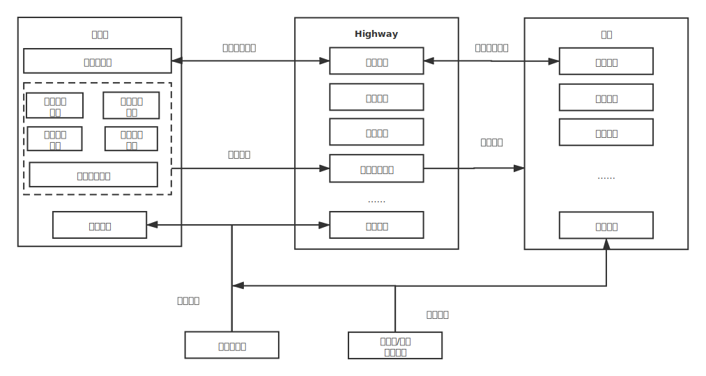

[English](./project.md) / 中文

# Highway

## 背景

近年来，国家将区块链作为核心技术自主创新的重要突破口，鼓励探索“区块链+”模式，从而推动区块链技术和产业创新发展，以促进区块链和实体经济的深度融合。由于联盟链既具有公链固有的数据不可篡改、去中心化、可取证、可溯源等特性，也引入了有限的中心化管理机制以提升整个系统的可运营、可监管性，其必将会在数字金融、政府交通、文化健康、智能制造、供应链管理、数字身份等领域发挥巨大作用，为构建产业互联网、推动传统产业转型升级提供新的动力。

目前主要的联盟链解决方案有 Hyperledger Fabric、R3 Corda、FISCO BCOS 等，它们虽然各有特点，也都解决了身份权限管理、数据隐私等联盟链中特有的问题，但由于技术选型问题，相同功能的组件（比如身份认证）在不同的平台上需要重复实现，这造成了大量的资源浪费；并且当用户因政策等原因需要更换加密、共识等算法实现时，其改造成本将十分巨大。

企业之间因业务发展可能需要进行数据共享、在线协同等方面的合作，如果这些企业都有一定的区块链业务积累，但因为选择了不同的联盟链底层，这些业务也就变成了数据孤岛，而要打破数据孤岛，其难度以及需要投入的资源往往是大部分企业无法承担的。

我们认为公链通过 token 的传递实现了价值互联网，而联盟链却是对传统信息互联网的补充。我们也坚信价值互联网终有一天会取代信息互联网成为新的现实，但它毕竟还是未来，未来需要一座桥梁来连接到现实世界，从央行发布的 DECP 上我们看到了未来与现实桥接的希望。

我们希望抓住中国及全世界正在悄然发生的经济、技术革命，通过一个简单易用、开放、共享、共赢的类似于中国高速公路系统一样的联盟链底层平台（我们叫它 Highway）来为实现分布式社会提供动力。

## 架构

## 进度

* 完成了基本的群组架构设计，实现了简单的以群组为单元的区块链网络，并以实际的存证应用（访问 [https://elixir.leeduckgo.com/](https://elixir.leeduckgo.com/) 进行体验，账号：highway，密码：leeduckgo）验证了其可行性。
* 实现了一些基本的链管理工具，使得用户能够低成本（无需了解和学习任何相关技术）的使用、管理区块链网络。

## 遇到的技术问题

* 问题：因为 Substrate 升级导致程序异常。解决方式：咨询社区或通过查看源码解决。
* 问题：Substrate 或 polkadot-js 文档更新不及时导致程序异常。解决方式：咨询社区或通过查看源码解决。

## 未来一年规划
### 第一阶段：横空出世

* 时间安排：1～2 个季度。
* 发布 Highway V1.0.0，使其符合[金融分布式账本技术安全规范](https://www.cfstc.org/bzgk/gk/view/bzxq.jsp?i_id=1855)要求，并提供组件（比如：身份鉴别、权限管理、共识、隐私算法等组件）复用以及可插拔替换机制，以解决资源浪费及用户难以自我定制链自带的组件实现的问题。
### 第二阶段：融合

* 时间安排：2～3 个季度。
* 发布 Highway V2.0.0，实现与 Hyperledger Fabric、R3 Corda、FISCO BCOS 等联盟链的互通，解决部分企业的数据孤岛问题。

### 第三阶段：连接未来

* 时间安排：2～3 个季度。
* 发布 Highway V3.0.0，实现联盟链与公链之间的互通机制。

## 市场定位

* 与物联网、大数据、AI、网络安全等其他技术融合，协助企业构建产业互联网、推动传统产业的数字化转型升级。
* 借助央行的 DECP，协助企业自行构建一个公链与联盟链相互协作的项目。

## 资源问题

现在团队成员在兼职进行设计与研发，因此希望能得到社区或投资机构的认可与支持，以便项目能够按照预期进行迭代。
