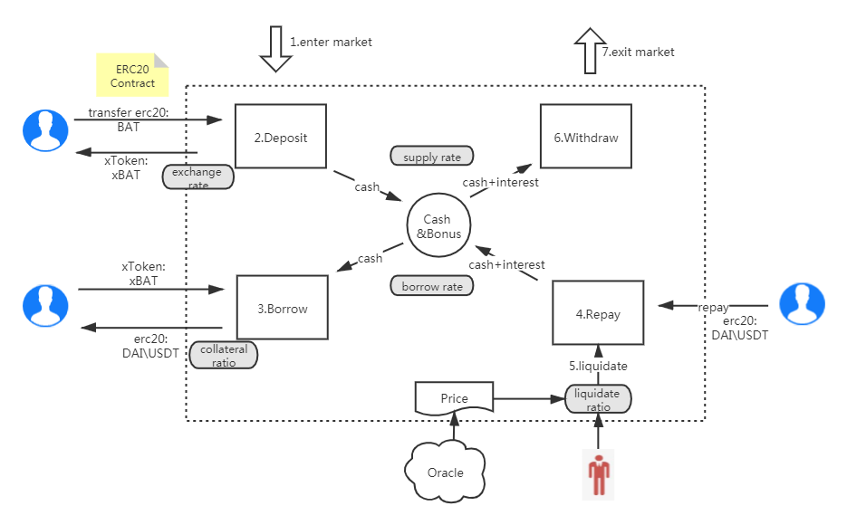
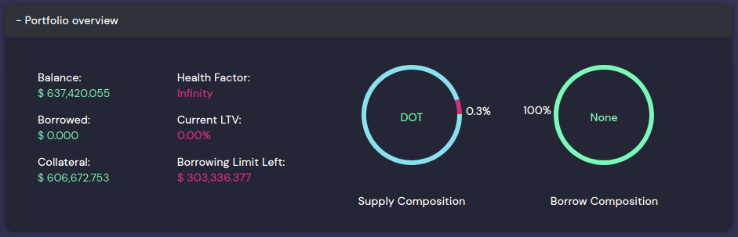
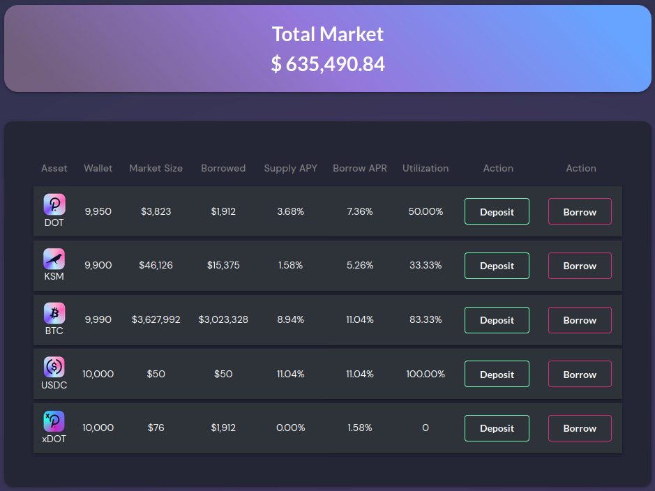
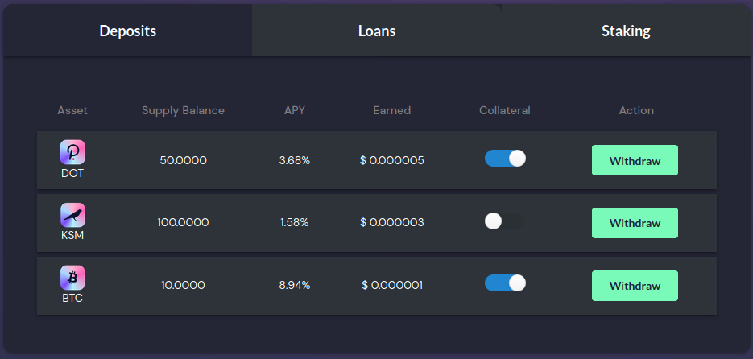
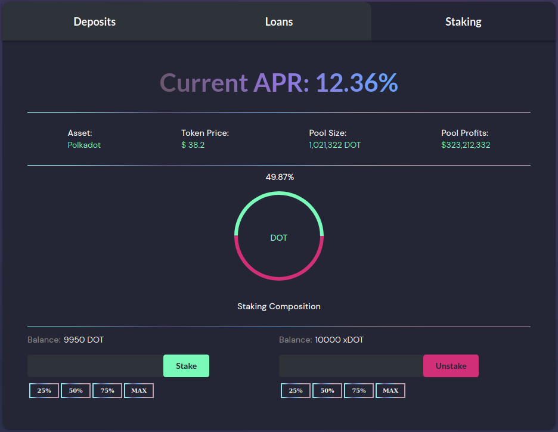
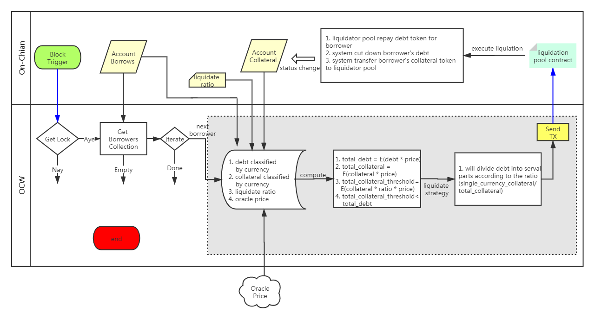
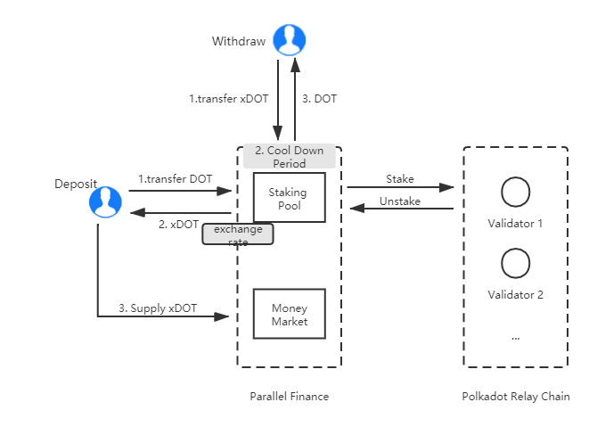

# Parallel Finance

### 项目背景

大量的DOT\KSM代币持有者有这样的实际需求：即通过质押赚取利息，又能一定程度上拥有代币流动性。然而目前市场上并没有一套成熟的解决方案。 Parallel Finance旨在基于polkadot生态系统构建一套先进的、最大的借贷协议；在提供借贷功能的基础上，我们允许用户同时从质押和借贷中赚取"double interests"。

### 目录

---

<!--ts-->

-   <a href="#technology">技术</a>
    -   <a href="#the-workflow-of-parallel">工作流</a>
    -   <a href="#ui-design">UI 设计</a>
    -   <a href="#storage">存储</a>
    -   <a href="#calls">调用</a>
    -   <a href="#events">事件</a>
    -   <a href="#interest-rate-model">利率模型</a>
    -   <a href="#the-process-of-auto-liquidation-algorithm">清算流程</a>
    -   <a href="#staking-dot">质押DOT</a>
-   <a href="#key-terms">术语</a>
-   <a href="#current-progress">项目进展</a>
-   <a href="#challenge-and-solution">挑战与解决方案</a>
-   <a href="#references">引用</a>
<!--te-->

### <a id="technology">技术</a>

本借贷协议方案启发于compound 协议，区块链解决方案基于substrate 3.0，有效解决了效率和拓展性问题，关键设计如下所示：

#### <a id="the-workflow-of-parallel">工作流</a>

---



### <a id="ui-design">UI 设计</a>

UI 已经部署到了我们官网: [parallel.fi](https://parallel.fi).

1. 总概
   

2. 投资组合
   

3. 市场
   

4. 存款和抵押
   

5. 提取
   

6. DOT 质押
   

#### <a id="storage">存储</a>

---

```rust
/// Container for borrow balance information
pub struct BorrowSnapshot {
    pub principal: Balance,
    pub interest_index: u128,
}

/// Total number of collateral tokens in circulation
TotalSupply = StorageMap<CurrencyId, Balance>

/// Total amount of outstanding borrows of the underlying in this market
TotalBorrows = StorageMap<CurrencyId, Balance>

/// Mapping of account addresses to outstanding borrow balances
AccountBorrows = StorageDoubleMap<CurrencyId,T::AccountId,BorrowSnapshot>

/// Mapping of account addresses to collateral tokens balances
AccountCollateral = StorageDoubleMap<CurrencyId,T::AccountId,Balance>

/// Accumulator of the total earned interest rate since the opening of the market
BorrowIndex = StorageMap<CurrencyId, u128>

/// exchangeRate = (totalCash + totalBorrows - totalReserves) / totalSupply
ExchangeRate = StorageMap<CurrencyId, u128>
```

#### <a id="calls">调用</a>

---

```rust
// User supplies assets into the market and receives cTokens in exchange
mint(origin: OriginFor<T>, currency_id: CurrencyId, mint_amount: Balance)

// User redeems cTokens in exchange for the underlying asset
redeem(origin: OriginFor<T>, currency_id: CurrencyId)

// User borrows assets from the protocol to their own address
borrow(origin: OriginFor<T>, currency_id: CurrencyId, borrow_amount: Balance)

// User puts supplies assets in collateral mode so that he/she can borrow other currencies
collateral_asset(origin: OriginFor<T>, currency_id: CurrencyId, enable: bool)

// User repays their own borrow
repay_borrow(origin: OriginFor<T>, currency_id: CurrencyId, repay_amount: Balance)

// User liquidates the borrowers collateral and the collateral seized is transferred to the liquidator
liquidate_borrow_internal(liquidator: T::AccountId, borrower: T::AccountId, liquidate_token: CurrencyId, repay_amount: Balance, collateral_token: CurrencyId)

// User stakes DOTs to the validator and receives xDOTs in exchange
stake(origin: OriginFor<T>, amount: Balance)

// User redeems DOTs from staking using the xDOTs
unstake(origin: OriginFor<T>, amount: Balance)
```

#### <a id="events">事件</a>

---

```rust
/// Rate related events
NewInterestParams(u128, u128, u128, u128),
BorrowRateUpdated(CurrencyId, u128),
SupplyRateUpdated(CurrencyId, u128),
UtilityRateUpdated(CurrencyId, u128),

/// Enable/Disable collateral for certain asset
CollateralAssetAdded(T::AccountId, CurrencyId),
CollateralAssetRemoved(T::AccountId, CurrencyId),

/// a collateral has been liquidatied
/// liquidator, borrower,liquidate_token,collateral_token,
/// liquidate_token_repay_amount,collateral_token_amount
LiquidationOccur(
    T::AccountId,
    T::AccountId,
    CurrencyId,
    CurrencyId,
    Balance,
    Balance,
)
```

#### <a id="the-process-of-auto-liquidation-algorithm">清算流程</a>

---


-   在早期阶段，我们提供两种清算方式：主动清算与基于**OCW**的自动清算
-   自动清算的本质是：链上将会有一个清算池，来执行清算操作
-   任何人都可以给清算池提供流动性，不会有**impermanent loss**, 同时也是我们发行治理型代币的一种方式
-   逐步地，借贷系统将在社区治理的模式下，向自动清算过渡，届时，将只允许链上清算池执行清算

#### <a id="interest-rate-model">利率模型</a>

---

Parallel finance 的利率将依据资金供需动态调整。因此，借贷利率将随区块动态变化。

##### 1. 兑换率

当借款人抵押资金到市场时，将依据**兑换率**转换为cTokens，根据**兑换率**的增长逐步获得利息收益。计算公式如下：

```
exchangeRate = (totalCash + totalBorrows - totalReserve) / totalSupply
```

##### 2. 使用率

**使用率**代表了已出借资金占总资金的份额，计算公式如下：

```
UtilizationRatio = Borrows / (Cash + Borrows)
```

##### 3. 储备金

Parallel finance 将从借款利息中转换一定比例的收益作为系统储备金，计算公式如下：

```
totalReserve_t+1 = interestAccumulated * reserveFactor + totalReserve_t
```

##### 4. 借款利率

Parallel finance 实现了跳跃式借款利率模型，当资金使用率超过一定比例时，超出比例的资金将使用更高的借款利率计算，计算公式如下：

如果 utilization rate <= kink,

```
Borrow Interest Rate = Base Rate + Multiplier ∗ Utilization Rate
```

如果 utilization rate > kink,

```
Borrow Interest Rate = Base Rate + Multiplier ∗ Utilization Rate + (Utilization Rate - kink) * jumoMultiplier
```

#### <a id="staking-dot">质押DOT</a>

---

由于 Polkadot 使用 NPoS (Nominated Proof-of-Stake)共识协议, DOT 持有者需要质押DOT到提名验证节点以赚取收益，而质押者也许希望质押了的DOT依然具备一定功用。

Parallel finance 提出了一种解决方案解锁质押DOT的流动性，同时不影响网络安全性。

##### 工作流

---



##### 质押

---

当用户质押DOT到质押池时，他将会基于兑换率收到xDOT，质押池将自动计算收益以激励用户质押得更早更久。计算公式如下：

```
exchangeRate = (totalCash + totalStakingRewards  - totalSlashes) / totalSupply
```

当用户收到xDOT时，他可以将xDOT用于如下场景

-   存款到借贷市场以获取双倍收益
-   使用xDOT作为抵押
-   交易xDOT
-   支付工具

目前，Parallel finance 使用polkadot网络建议的自动选择验证人机制，我们将实现功能以允许xDOT持有者投票给特定验证节点。

##### 赎回

---

当xDOT持有者想要赎回DOT时，将有28天的冷却期，我们将提升性能以减少冷却期，使用户能够更早的赎回。

如果在DOT质押期内某个提名验证节点受到惩罚，Parallel finance将基于储备池资金覆盖掉用户损失。

### <a id="key-terms">术语</a>

---

-   **Underlying Asset**: 用户提供的资产
-   **cToken**: 当用户抵押资产时，系统将依据兑换率返回存款凭证
-   **Exchange Rate**: cToken 和 underlying assets的兑换凭证.初始阶段没有人存款时，保持初始兑换率，随着资金变化而不断变化
-   **Utilization Rate**: 资金借出率
-   **Supply Rate**: 存款利率，每一区块都会动态计算与改变
-   **Borrow Rate**: 借款利率，与资金使用率相关
-   **Collateral Factor**: 抵押率，用户抵押资金所能借出的最大比例；根据数字货币波动性、流动性、市值不同而不同，比率一般位于0~1
-   **Reserve**: 利息收益的一部分将进入储备池，比率由 `Reserve Factor`决定, 位于 0~1之间
-   **Liquidation**: 清算率，当出现“资不抵债”时，清算人可以替欠款人还债，同时以低于市价的方式购入欠款人的抵押，以使欠款人账户健康；降低系统风险
-   **Close Factor**: 清算比率，当出现清算时，清算者一次可以对债务人债务进行多少比率的清算, 位于 0~1之间
-   **Liquidation Incentive**: 清算奖励，抵押品将低于市价清算，清算的收益由此比率计算

### <a id="current-progress">项目进展</a>

---

-   [x] 完成存款与计息
-   [x] 完成抵押与借款
-   [x] 链下工作机喂价
-   [x] 链下工作机进行自动清算
-   [ ] 质押DOT，从质押和借贷中获取双倍收益(进行中)

### <a id="challenge-and-solution">挑战与解决方案</a>

---

-   我们注意到许多 DOT 和 KSM 代币 将质押到验证者/提名者 ，然而，代币持有者想要从质押代币中赚取额外收益。
    通过Parallel Finance,用户可以质押DOT获取xDOT，然后通过借出xDOT赚取收益或者作为抵押借出其他资产；
    我们会开发出更多的使用场景。
-   在开发中，我们没有找到更适合的预言机解决方案，因此我们通过**链下工作机**作为喂价，它使用多个数据源以及基于时间权重的价格平均数

### <a id="references">引用</a>

-   [Compound WhitePaper](https://compound.finance/documents/Compound.Whitepaper.pdf)
-   [Compound，区块链银行运作原理](https://juejin.cn/post/6844903774620745742#part-2)
-   [Understanding Compound protocol's interest rates](https://ian.pw/posts/2020-12-20-understanding-compound-protocols-interest-rates)
-   [COMPOUND 这种理财到底是什么？](http://baijiahao.baidu.com/s?id=1670026342401380785)
-   [原力研究院丨 Compound：货币市场协议（中文白皮书）](https://www.chainnews.com/articles/465280458982.htm)
