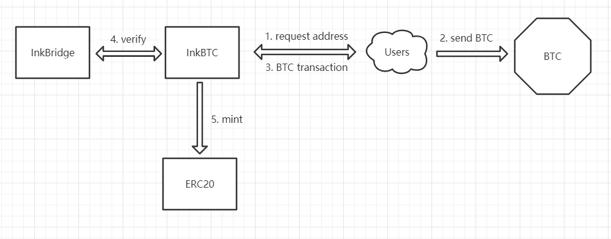

# 项目背景

当前区块链世界中有数千条公链，各个项目都有自己的创新。然而单个公链无法覆盖所有的应用场景，满足全部的创新需求。这也就使得跨链技术应运而生。跨链技术可以实现不同区块链之间的资产转移，读取验证其他链的状态和事件，提升区块链的处理能力。

当前区块链的跨链技术主要有公证人机制、侧链/中继链、哈希锁定。Polkadot就是以侧链/中继链实现跨链的技术代表。以substrate开发的平行链可以很方便地接入Polkadot网络。同时Polkadot提供转接桥服务来将已经存在的公链(如BTC、ETH等)接入波卡生态。

当前波卡生态内的转接桥项目主要有PolkaBTC、Snowfork等。在研究了这些项目后，我们发现当前的转接桥项目有如下不足：

1. 多在平行链的层面开发，需要通过拍卖获得插槽，成本较高
2. 大多停留在价值转移，而无法提供其他链状态等的验证，更无法为其他平行链链或合约提供自定义格式的交易验证
3. 一个项目只能转接一条公链，效率较低

综上所述，当前存在的转接桥项目可扩展性低而运行成本高。因而我们提出InkBridge项目。 InkBridge基于Ink语言编写，使用Wasm合约技术构建转接桥，可以部署到所有支持Wasm合约的平行链，把多条公链(BTC, ETH等)的转接桥下沉为平台，为上层应用提供链数据和状态的验证而不只停留于价值转移。社区项目方可以调用合约提供的接口将InkBridge接入自身项目实现更多的功能。在合约层面的实现大大提高了扩展性的同时也降低了接入成本。同时，InkBridge依托Patract智能合约生态提供的免费开发工具和基础设施服务，使用了Redspot,Europa和Elara等工具套件来方便合约和前端的部署与调试，大大降低了项目方和开发者的学习成本。

InkBridge将首先接入BTC为其他合约提供基础的转接桥服务。同时为了更好地让项目方和开发者接入我们的项目，我们还提供了一个InkBTC的demo应用，实现了基础的BTC锁定和转移功能。

# 项目技术设计
## InkBridge

在InkBridge的架构中，主要包含有InkBridge合约、Relayer、前端、上层应用这四个部分。

### InkBridge合约
InkBridge合约是本项目中最为核心的部分，主要提供链信息存储和上层应用接口。

* 链信息存储

InkBridge合约是一个实现在合约层的轻节点，接受relayer提交的区块信息，对其中的区块难度等进行校验。校验成功后更新自身存储的最新区块并对Relayer分发奖励。

* 上层应用接口

InkBridge合约允许上层应用验证交易和区块，获取区块链的区块和交易信息。项目方可以提交交易哈希和对应的merkle tree信息来验证交易的合法性，从而实现自身的应用逻辑。InkBridge合约会对接入的项目方收取部分费用来支付Relayer和运营方维护的成本。

### Relayer
Relayer获取转接目标链的最新区块，将其提交给InkBridge合约。为了激励relayer提交区块，会给予提交成功的relayer奖励，但是只有最先提交的relayer会拿到合约的奖励。

### 前端
前端会实时向InkBridge合约请求内部存储信息，向用户展示Bridge中存储的区块链最新块头和来自其他项目方的验证请求与结果。

### 上层应用
上层应用通过调用InkBridge合约的接口来获取目标链的区块和交易信息，对相关信息进行验证来实现自身的逻辑。

## InkBTC

InkBTC是我们提供的示例demo，为项目方和开发者演示了如何通过和我们的InkBridge交互来将BTC转移至波卡网络。InkBTC的获取步骤如下。
1. 用户通过我们提供的前端向InkBTC合约发起一个获取BTC充值地址的请求。合约会返还给用户一个BTC地址。
2. 用户向获取到的地址发送的BTC。
3. 在交易被打包后用户将交易的哈希发送给InkBTC合约进行验证。
4. 合约收到交易验证请求后会向InkBridge合约发起交易验证请求，确保用户提交的验证交易已经被打包且不可逆。
5. InkBTC在确认交易的真实性后将对应的ERC20 BTC发送给用户想要充值的地址。

# 项目进展
当前项目已经基本完成，主要包括如下内容。
1. InkBridge 合约。合约可以接收relayer提交区块，对其进行验证后更新合约的最长链。同时也完成了提供给外部合约的接口，供项目方查询存储的链信息和对项目方传递的交易进行验证。
2. Relayer。已经完成一个Relayer客户端，可以利用该客户端向InkBridge合约提交最新的区块信息。
3. InkBridge 前端。已经完成InkBridge的前端，可以动态展示合约中存储的最长链信息和交易验证请求。
4. InkBTC示例应用。已经完成示例应用的前端和合约，可以将BTC转移至波卡平行链上。

# 技术难点与解决方案
1. btc-relayer 上传区块头到 ink! 合约
向节点获取区块信息后分离出关键的区块头信息，直接在relayer代码中调用bridge合约

2. ink! 合约对btc 区块头进行校验，并确认区块和最长链
将比特币客户端的校验和分叉处理的功能通过ink来实现，判断最长链后存储。每次收到区块校验后都检查最长链是否更新。

3. ink! 合约实现SPV功能，对用户上传的交易和merkle proof 进行验证
开发了工具可以根据比特币交易hash在链下获取交易的原文以及merkle证明，用户只需要将交易原文和证明信息上传到合约，合约可以验证交易的有效性。

4. ink! 合约实现了对 btc 交易脚本解析，可得到交易的详细信息
开发了no_std的比特币交易解析库，可以用于在ink！合约中解析交易。

# 项目规划

## 开发规划
1. 2021年第一季度实现转接桥对BTC的支持，并将转接桥和示例应用部署至Jupiter、Canvas等支持wasm合约的测试网供项目方和开发者测试

2. 2021年第二季度
* 收集项目方和开发者的建议，改进转接桥功能，完善示例应用，正式将InkBridge部署至Jupiter、Canvas等主网，供项目方接入
* 实现转接桥对ETH的支持并在测试网上对相关功能测试，保证功能完善后部署至主网供项目方接入
* 完善对项目方收取手续费和激励Relayer的经济模型以及社区治理的DAO模型
* 进一步依托Patract平台的工具套件为开发者和用户提供更好的支持和使用体验

3. 后续开发计划
* 研究和开发对非POW链的转接

## 运营规划
* 完善开发文档，方便项目方和开发者接入项目以及其余Relayer节点部署
* 制定合理的治理模型，通过社区治理来决策项目关键参数以及新的转接桥接入等
* 寻求Patract等知名wasm合约平台的合作，依托其平行链平台推广自身项目
* 将项目提交至各类DApp store和平台(如PatraStore等)，提升项目知名度
* 建立开发者社群，接收来自项目方和开发者的建议改进产品

## 商业模式
* 团队为非盈利组织，所有收取的费用都将转入基金库用于支付relayer奖励和覆盖开发成本
* 在项目初期，团队会自身运行relayer节点保证InkBridge中存储链信息和目标链主网同步
* 在项目方接入到一定规模后，对项目方收取部分手续费，该笔费用会转入基金库。该基金库由社区的DAO组织来管理，会定期基于Relayer的表现给予奖励。开发团队则需要向基金会申请奖励用于覆盖自身开发成本。

# 市场定位及调研
## 市场定位
InkBridge是一个基于wasm合约技术提供跨链服务的底层平台。其主要目的是为波卡生态中的链上合约以及平行链提供跨链的信息传递和验证。在功能上，我们不满足于跨链的价值转递，而是更进一步实现了一个基于合约的轻节点，完成了目标链的迁移。在扩展性上，我们基于wasm合约编写，不仅可以部署到所有wasm合约平台，提供的合约接口更是大大降低了其余项目调用的成本。 我们与生态中其他的跨链项目（如PolkaBTC）并不构成竞争关系。相反其余跨链项目也可以使用我们的接口来辅助自身的开发。

## 市场调研
当前波卡生态中并没有提供跨链信息传递和验证的底层平台。其余跨链项目如PolkaBTC, 以及以太坊生态中的wBTC都是BTC价值锚定的项目，正如定位中提到的，这些项目和我们的项目并没有竞争关系。
* PolkaBTC

PolkaBTC基于波卡平行链，采用了XCLAIM框架开发。允许用户1:1锁定BTC并铸造PolkaBTC, 从而将BTC价值转移至波卡生态中。
* wBTC

wBTC等以太生态中的BTC跨链项目是中心化控制的双向锚定跨链项目。只能由具备完整KYC/AML资格的注册商家发起。

# Background of the project

There are thousands of public chains in the current blockchain world, and each project has its own innovation. However, a single public chain can't cover all application scenarios and meet all innovation needs. This has led to the emergence of cross-chain technology. Cross-chain technology can realize the transfer of assets between different blockchains, read and verify the status and events of other chains and improve the processing capability of the blockchain.

The current cross-chain technology of blockchain mainly includes notary mechanism, side chain/relay chain, and hash lock. Polkadot is the technical representative of cross-chain realization by side chain/relay chain. Parachains developed with substrate can be easily connected to the Polkadot network. At the same time, Polkadot provides transit bridge services to connect existing public chains (such as BTC, ETH, etc.) to the Polkadot ecosystem.

The current transit bridge projects in the Polkadot ecology mainly include PolkaBTC, Snowfork, etc. After studying these projects, we found that they have the following shortcomings:

1. It is mostly developed at the level of parachains. In this case, slots need to be obtained through auctions, which is costly
2. Most of them aim at value transfer, and can't provide verification of other chain's status, let alone provide custom format transaction verification for other parachains or contracts
3. A project can only connect one public chain, which is inefficient

In summary, the existing transit bridge projects have low scalability and high operating costs. So we proposed the InkBridge project. InkBridge is written based on the Ink language and uses Wasm contract technology to build a transit bridge. It can be deployed to all parachains that support Wasm contracts. The transit bridges of multiple public chains (BTC, ETH, etc.) will perform as a platform for upper-level applications. And it's not just transferring BTC to the Polkadot but also the verification of chain data and status. Community project parties can call the interface provided by the contract to connect to InkBridge to achieve more functions. Implementation at the contract level greatly improves scalability while also reducing access costs. At the same time, InkBridge relies on the free development tools and infrastructure services provided by the Patract smart contract ecosystem and uses their tool suites such as Redspot, Europa and Elara to facilitate the deployment and debugging of contracts and front-ends, which greatly reduces the learning costs of organizations and developers.

InkBridge will first provide basic transit bridge services for BTC. At the same time, in order to help organizations and developers to connect to our project, we also provide a demo application(InkBTC), which implements basic BTC locking and transfer functions.

# Project Technical Design
## InkBridge

In the architecture of InkBridge, it mainly includes four parts: InkBridge contract, Relayer, front-end, and upper application.

### InkBridge contract
The InkBridge contract is the most core part of this project, which mainly provides chain information storage and upper-level application interfaces.

* Chain information storage

The InkBridge contract is a light node implemented at the contract layer, accepting block information submitted by the relayer and verifying the difficulty of the block. After successful verification, it will update the latest block and distribute rewards to Relayer.

* Upper-level application interfaces

The InkBridge contract allows upper-level applications to verify transactions and blocks, and obtain block and transaction information of the target blockchain. Other projects can submit the transaction hash and corresponding merkle tree information to verify the legitimacy of the transaction, thereby implementing its own application logic. The InkBridge contract will charge part of the fees to the connected projects to pay for the maintenance of the Relayer and the development.

### Relayer
Relayer obtains the latest block of the target chain and submits it to the InkBridge contract. In order to incentivize the relayer to submit the block, the first relayer who submits successfully will be rewarded.

### front end
The front end will request internal storage information from the InkBridge contract in real time, and show users the latest block header of the blockchain stored in Bridge. Verification requests and results from other projects will also be listed.

### Upper application
The upper application obtains the block and transaction information of the target chain by calling the interface of the InkBridge contract, and verifies the relevant information to implement its own logic.

## InkBTC

InkBTC is a sample demo provided by us, which demonstrates how to transfer BTC to the Polkadot network by interacting with our InkBridge. The steps to obtain InkBTC are as follows.
1. The user initiates a request for the BTC deposit address to the InkBTC contract through the front-end provided by us. The contract will return a BTC address to the user.
2. The user sends BTC to the obtained address.
3. After the transaction is packed, the user sends the hash of the transaction to the InkBTC contract for verification.
4. After the contract receives the transaction verification request, it will initiate a transaction verification request to the InkBridge contract to ensure that the verification transaction submitted by the user has been packed and is irreversible.
5. After confirming the authenticity of the transaction, InkBTC will send the corresponding ERC20 BTC to the user.

# Project Progress
The current project has been basically completed, mainly including the following content.
1. InkBridge contract. The contract can receive the relayers' submission of the block, verify it and update the longest chain in the contract. At the same time, we also completes the interface provided to the external contracts for other projects to query the stored chain information and verify the transactions.
2. Relayer. A Relayer client has been completed, which can be used to submit the latest block information to the InkBridge contract.
3. InkBridge front end. The front end of InkBridge has been completed, which can dynamically display the longest chain information stored in the contract and transaction verification requests.
4. InkBTC sample application. The front end and contract of the sample application have been completed, and BTC can be transferred to the Polkadot parachain on testnet.

# Technical difficulties and solutions
1. btc-relayer uploads the block header to the ink! contract
After obtaining the block information from the node, separate the key block header information, and directly call the bridge contract in the relayer codes

2. The ink! contract verifies the btc block header and confirms the block and the longest chain
The checksum and fork processing function of the Bitcoin client is implemented through ink, and the longest chain is judged and stored. Every time a block check is received, the longest chain will be updated.

3. The ink! contract implements the SPV function to verify the transaction and merkle proof uploaded by the user
A tool has been developed to obtain the original text of the transaction and the merkle proof under the chain based on the Bitcoin transaction hash. Users only need to upload the original transaction and proof information to the contract, and the contract can verify the validity of the transaction.

4. The ink! contract has to analyze of the btc transaction script
Developed no_std bitcoin transaction analysis library, which can be used in ink! Analyze the transaction in the contract.

# Project Plan

## Development Plan
1. In the first quarter of 2021, the transit bridge will support BTC, and the transit bridge and sample applications will be deployed to Jupiter, Canvas and other test networks that support wasm contracts for projects and developers to test

2. Second quarter of 2021
* Collect the suggestions of other projects and developers, improve the transit bridge function, improve the sample application, and formally deploy InkBridge to Jupiter, Canvas and other main networks
* Realize the ETH support of the transit bridge and test related functions on the test network to ensure that the functions are completed and deploy to the main network
* Improve the economic model of charging fees and incentive Relayers. Complete the DAO model of community governance
* Further rely on the tool suite of the Patract platform to provide developers and users with better support and experience

3. Follow-up development plan
* Research and develop the transit bridge of non-POW chains

## Operation Plan
* Improve the development documentation to facilitate projects and developers to access the project and the deployment of Relayer nodes
* Develop a reasonable governance model, and use community governance to determine key parameters and access to new transit bridges, etc.
* Seek cooperation with well-known wasm contract platforms such as Patract
* Submit the project to various DApp stores and platforms (such as PatraStore, etc.) to increase the visibility of the project
* Establish a developer community to receive suggestions from projects and developers to improve the product

## Business Model
* The team is a non-profit organization, and all fees collected will be transferred to the treasury to pay for relayer rewards and cover development costs
* At the beginning of the project, we will run the relay node to ensure that the chain information stored in InkBridge is synchronized with the main network of the target chain
* After more project connected to InkBridge, a verification fee will be charged and the fee will be transferred to the treasury. The treasury is managed by the community's DAO organization and will be rewarded regularly based on Relayer's performance. The development team needs to apply to the DAO organization for rewards to cover its own development costs.

# Market Position and Research
## Market Position
InkBridge is an underlying platform that provides cross-chain services based on wasm contract technology. Its main purpose is to provide cross-chain information transmission and verification for the on-chain contracts and parachains in the Polkadot ecology. We are not only satisfied with cross-chain value transfer, but have further implemented a contract-based light node. In terms of scalability, we write based on the wasm contract, which can not only be deployed to all wasm contract platforms, but also the contract interfaces greatly reduce the cost of other projects who want to connect to our bridge. We do not constitute a competitive relationship with other cross-chain projects in the ecosystem (such as PolkaBTC). On the contrary, other cross-chain projects can also use our interfaces to assist their own development.

## Market Research
There is no underlying platform for cross-chain information transmission and verification in the current Polkadot ecosystem. Other cross-chain projects such as PolkaBTC and wBTC are BTC value-anchored projects. As we've mentioned before, these projects have no competitive relationship with our projects.

* PolkaBTC

PolkaBTC is based on the Polka Parachain and is developed using the XCLAIM framework. Allow users to lock BTC 1:1 and mint PolkaBTC, thereby transferring the value of BTC to the Polkadot Ecology.
* wBTC

BTC cross-chain projects in the ethereum ecosystem such as wBTC are two-way anchored cross-chain projects under centralized control. It can only be initiated by registered merchants with complete KYC/AML qualifications.

