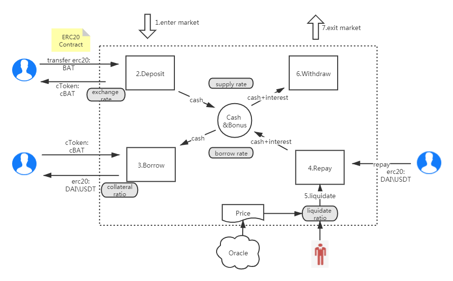

# Parallel Finance

### Project background

Currently, there is a substantial demand from DOT and KSM token holders for cash liquidity and earn interests from their assets with no mature solution on the market. Parallel finance aims to be the first and largest decentralized lending protocol built on top of the polkadot ecosystem. In addition to providing lending and borrowing features, we will also allow users to earn "double interests" from staking and lending their tokens simultaneously.

### Table of contents

---

<!--ts-->

-   [Technology](#technology)
    -   [Workflow](#the-workflow-of-parallel)
    -   [Storage](#storage)
    -   [Calls](#calls)
    -   [Interest Rate Model](#interest-rate-model)
    -   [Liquidation Process](#the-process-of-liquidation)
    -   [Staking DOT](#staking-dot)
-   [Key Terms](#key-terms)
-   [Current Progress](#current-progress)
-   [Challenge and Solution](#challenge-and-solution)
-   [References](#references)
<!--te-->

### Technology

The lending protocol was inspired by compound protocol and our blockchain solution is developed on substrate 3.0, which allows for efficiency and scalability. Here's our key design:

#### The workflow of Parallel

---



#### Storage

---

```rust
/// Container for borrow balance information
pub struct BorrowSnapshot {
    pub principal: Balance,
    pub interest_index: u128,
}

/// Total number of collateral tokens in circulation
TotalSupply = StorageMap<CurrencyId, Balance>

/// Total amount of outstanding borrows of the underlying in this market
TotalBorrows = StorageMap<CurrencyId, Balance>

/// Mapping of account addresses to outstanding borrow balances
AccountBorrows = StorageDoubleMap<CurrencyId,T::AccountId,BorrowSnapshot>

/// Mapping of account addresses to collateral tokens balances
AccountCollateral = StorageDoubleMap<CurrencyId,T::AccountId,Balance>

/// Accumulator of the total earned interest rate since the opening of the market
BorrowIndex = StorageMap<CurrencyId, u128>

/// exchangeRate = (totalCash + totalBorrows - totalReserves) / totalSupply
ExchangeRate = StorageMap<CurrencyId, u128>
```

#### Calls

---

```rust
// Sender supplies assets into the market and receives cTokens in exchange
mint(who: &T::AccountId, currency_id: &CurrencyId, mint_amount: Balance)

// Sender redeems cTokens in exchange for the underlying asset
redeem(who: &T::AccountId, currency_id: &CurrencyId, redeem_amount: Balance)

// Sender borrows assets from the protocol to their own address
borrow(borrower: &T::AccountId, currency_id: &CurrencyId, borrow_amount: Balance)

// Sender put supplies assets in collateral mode so that he/she can borrow other currencies
collateral_asset(borrower: &T::AccountId, currency_id: &CurrencyId, enable: bool)

// Sender repays their own borrow
repay_borrow(borrower: &T::AccountId, currency_id: &CurrencyId, repay_amount: Balance)

// The sender liquidates the borrowers collateral and the collateral seized is transferred to the liquidator
liquidate_borrow_internal(liquidator: T::AccountId, borrower: T::AccountId, liquidate_token: CurrencyId, repay_amount: Balance, collateral_token: CurrencyId)

// Sender stakes DOTs to the validator and receives xDOTs in exchange
stake_internal(who: &T::AccountId, amount: Balance)

// Sender redeems DOTs from staking using the xDOTs
unstake_internal(who: &T::AccountId, amount: Balance)
```

#### The process of Liquidation

---

-   Auto trigger in **OCW**
-   Iterate borrowers' account and fetch each Currency Collateral one by one
-   Calculate liquation threshold: liquidate limit = Collateral currency _ current price _ liquation ratio
-   Fetch each currency's debt position, such as DAI\USDC
-   Compare debt position and liquation threshold
-   If debt position > liquidate limit, trigger liquidation
-   Only liquation pool can execute liquidation
-   Every time we can only liquidate 50% of debt position, until debt position < liquidate limit
-   The Collateral token will be liquidated at 90 percent of current market price
-   the 10 percent will be incentive for the liquidator and punishment for the debtor

#### Interest Rate Model

---

The interest rate in Parallel finance is dynamically determined by the supply and demand. Therefore, the borrow and supply interests could vary in different blocks.

##### 1. Exchange Rate

When a lender deposits an asset to the money market, it will be converted to cTokens based on the exchange rate. The lender earns interest through the appreciation of cToken's exchange rate

```
exchangeRate = (totalCash + totalBorrows - totalReserve) / totalSupply
```

##### 2. Utilization Rate

Utilization rate represents the percentage of borrows in the total money market.

```
UtilizationRatio = Borrows / (Cash + Borrows)
```

##### 3. Reserves

Parallel finance converts a certain portion of borrower interest into reserves

```
totalReserve_t+1 = interestAccumulated * reserveFactor + totalReserve_t
```

##### 4. Borrow Rate

Parallel finance implements the jump interest model. When the utilization rate exceeds the kinks, the jump rate will be applied to the excess portion.

If utilization rate <= kink,

```
Borrow Interest Rate = Base Rate + Multiplier ∗ Utilization Rate
```

If utilization rate > kink,

```
Borrow Interest Rate = Base Rate + Multiplier ∗ Utilization Rate + (Utilization Rate - kink) * jumoMultiplier
```

#### Staking Dot

---

As Polkadot uses NPoS (Nominated Proof-of-Stake), DOT holders stake their DOT tokens to nominate validators to earn yields. Stakers may want to expand the utility of their staked DOT.

Parallel finance comes out a solution to unlock the liquidity of staked DOT without compromising the security of the network.

##### Workflow

---


##### Staking

---

When the user deposit DOT to the staking pool, he will receive xDOT based on the exchange rate. The staking pool compounds the reward automatically which incentivizes the user to stake early and longer.

```
exchangeRate = (totalCash + totalStakingRewards  - totalSlashes) / totalSupply
```

After a user receives xDOT, he could use XDOT in the following scenario:

-   Supply xDOT to money market to earn double interest
-   Use xDOT as collateral to borrow other assets
-   Trade xDOT in open markets
-   use xDOT as payment

Parallel finance uses auto-selected validators recommanded by polkadot network for now, we will implement features that allow xDOT holders to vote for specific validators.

##### Unstaking

---

There is a 28 days cool down period for xDOT holders who want to redeem DOT. We will improve features to reduce the cool down period and create a xDOT/DOT market for users who need early redemption.

If a nominated validator is slashed during the staking period, Parallel finance will use its reserve fund to cover the lose.

### Key Terms

---

-   **Underlying Asset**: The assets provided by users
-   **cToken**: After the collateral of underlying assets, the system will return a certain amount of cToken to the user according to the exchange rate
-   **Exchange Rate**: The exchange rate between cToken and the underlying assets. When no one deposits assets to earn interest, there will be an initial Exchange rate, and the exchange rate will continue to increase over time
-   **Utilization Rate**: The utilization rate of cash
-   **Supply Rate**: The calculation of the supply rate requires the borrowing rate to be obtained first. Like the borrowing rate, it is calculated once for each block, and the lender in the same block obtains the same lending rate for the same asset
-   **Borrow Rate**: Borrow rate is affected by utilization rate
-   **Collateral Factor**: For different assets, there are different collateral factors. The range of the collateral factor is 0-1, which represents the ratio of the value of the user's collateral asset to the available loan. When it is zero, it means that this type of asset cannot be used as collateral to borrow other assets.
-   **Reserve**: A part of the interest income will be retained as a reserve for the currency. This retained part is determined by the `Reserve Factor`, and the reserve factor is between 0 and 1.
-   **Liquidation**: Liquidation means that when the value of the collateral assets is less than the value of the loan, the liquidator can replace part of the repayment of the liquidated person. Currently, it can repay up to 50% at a time, and the liquidator can obtain the collateral assets of the liquidated person. A certain percentage of cToken is rewarded.
-   **Close Factor**: During the liquidation process, the liquidator can help the lender to pay off the maximum debt ratio, between 0 and 1, currently 50%. This factor can be called continuously until the user's loan order is in a safe state.
-   **Liquidation Incentive**: liquidators get some rewards. For example: 8%.

### Current Progress

---

-   [x] Lenders can deposit asset and accure interest
-   [x] Borrowers can use assets as collateral to borrow
-   [x] Off chain worker price feed
-   [x] Auto liquidation by off chain worker
-   [ ] Staking DOT to earn double interests from both staking and lending (In progess)

### Challenge and Solution

---

-   We noticed many DOT and KSM tokens will be staked as validators/nominators. However, token holders may want to earn interests with their staked tokens.
    Through Parallel Finance, users can stake DOT and get xDOT in return. Users can then lend out xDOT to earn interests or use it as collateral to borrow other assets. We will explore more use case in the future.
-   We couldn't find a matured oracle solution during the development, so we implemented the price feed using off-chain worker, which will use multiple sources and time-weighted average price.

### References

-   [Compound WhitePaper](https://compound.finance/documents/Compound.Whitepaper.pdf)
-   [Compound，区块链银行运作原理](https://juejin.cn/post/6844903774620745742#part-2)
-   [Understanding Compound protocol's interest rates](https://ian.pw/posts/2020-12-20-understanding-compound-protocols-interest-rates)
-   [COMPOUND 这种理财到底是什么？](http://baijiahao.baidu.com/s?id=1670026342401380785)
-   [原力研究院丨 Compound：货币市场协议（中文白皮书）](https://www.chainnews.com/articles/465280458982.htm)
